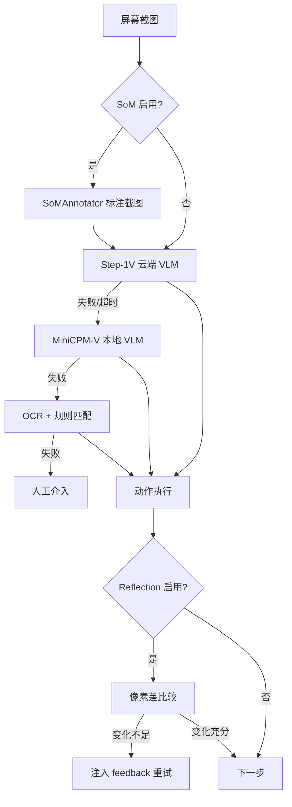
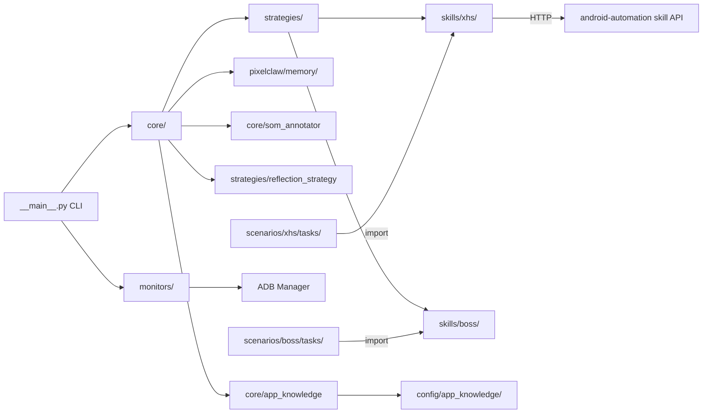
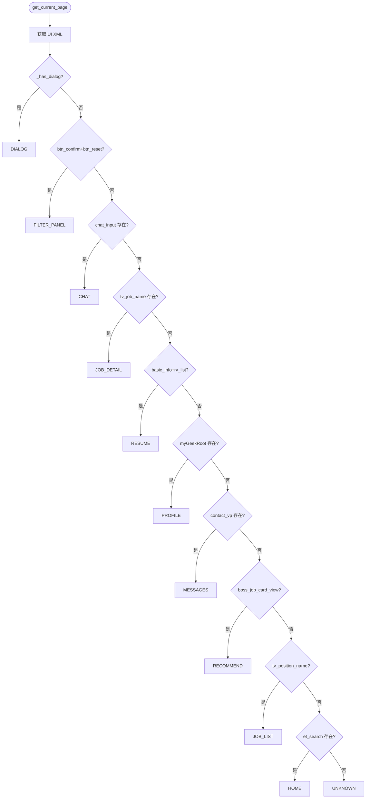

# PROJECTWIKI.md — PixelClaw

## 1. 项目概述

- **目标**：基于视觉识别的 Android 自动化系统，运行于 Raspberry Pi 5（aarch64）上，控制 Pixel 8a 完成小红书（XHS）、微信等 App 的自动化操作
- **背景**：通过 ADB + Shizuku 驱动设备，使用多级 VLM/OCR 策略分析屏幕并执行动作
- **运行环境**：Raspberry Pi 5 (aarch64) + Android Pixel 8a，Python 3.x
- **调用方式**：`python -m pixelclaw [subcommand]`

## 2. 架构设计

### 多级回退策略（含 SoM + Reflection 扩展）

### 整体模块关系

## 3. 架构决策记录（ADR）

- 目录：`docs/adr/`（待建立）
- 关键决策：使用 HTTP API (`http://localhost:18791/v1/skills/android-automation/execute`) 解耦任务脚本与核心包，部分老脚本使用 `sys.path.insert` 直接导入

## 4. 设计决策 & 技术债务

| 类型 | 描述 | 优先级 |
|------|------|--------|
| 技术债务 | `pixelclaw/memory/` 子包与项目根目录同名，命名混淆 | 低 |
| 技术债务 | `XHSAutomationSkill` 绕过 core ADBManager 直接调 subprocess | 低 |
| 技术债务 | `apply_btn`（投递简历）resource-id 未在真机验证——直聘模式职位仅显示 btn_chat | 低 |
| 技术债务 | 消息页/聊天页额外功能区（发送图片/简历附件/面试邀请卡片）resource-id 未探索 | 低 |
| 技术债务 | 公司详情页（COMPANY_DETAIL）、投递记录页（APPLICATIONS）尚无真机 XML dump，PageState 识别依赖 inferred 元素 | 低 |
| 技术债务 | `test_reflection_strategy.py`：`Image.fromarray(arr, "RGB")` 的 `mode` 参数在 Pillow 13 弃用，届时需移除 | 低 |
| 技术债务 | `test_som_strategy.py`：`asyncio.get_event_loop()` 在 Python 3.10+ 无当前事件循环时触发 DeprecationWarning，建议改用 `asyncio.run()` | 低 |

## 5. 模块文档

| 模块 | 职责 |
|------|------|
| `core/` | 设备连接、视觉分析、动作执行核心逻辑 |
| `core/som_annotator.py` | SoM 标注器：将 UIAutomator XML 转为带编号截图 |
| `core/app_knowledge.py` | AppAgent 风格 App 知识库加载与 Prompt 注入 |
| `strategies/` | VLM/OCR 多级回退策略实现 |
| `strategies/reflection_strategy.py` | 像素差反思机制：判断动作是否生效 |
| `strategies/som_strategy.py` | SoM 策略包装器：解析 som_id 为真实坐标 |
| `monitors/` | ADB 管理、连接监控、Shizuku 权限管理 |
| `services/` | 保活服务 |
| `skills/xhs/` | 小红书（XHS）自动化 skill（UIAutomator 坐标驱动） |
| `skills/boss/` | Boss直聘自动化 skill（ADBManager 驱动） |
| `scenarios/xhs/` | XHS 场景：任务脚本、工具脚本、文档 |
| `scenarios/boss/` | Boss直聘场景：求职工作流、文档 |
| `config/app_knowledge/` | 各 App 的 AppAgent 格式知识库 JSON |
| `tasks/` | 通用任务脚本（微信、测试等） |
| `scripts/` | 通用环境安装与连接测试脚本 |
| `config/` | 设备与系统配置文件 |
| `docs/` | 通用项目文档 |
| `pixelclaw/memory/` | 三层记忆系统（capture → store → recall） |
| `tests/` | 单元测试（pytest，193 tests，无真机依赖） |

### BOSSAutomationSkill 详细说明（`skills/boss/boss_automation_skill.py`）

**导出常量类**：

| 类 | 用途 |
|----|------|
| `PageState` | 页面状态字符串常量：`HOME / JOB_LIST / JOB_DETAIL / CHAT / DIALOG / UNKNOWN / RECOMMEND / MESSAGES / PROFILE / FILTER_PANEL / COMPANY_DETAIL / RESUME / APPLICATIONS` |
| `DialogType` | 弹窗类型常量：`DAILY_LIMIT / LOGIN_REQUIRED / JOB_OFFLINE / EXISTING_CHAT / DISMISSED / NONE / UNKNOWN_DIALOG` |
| `ChatEntry` | 消息列表条目 dataclass：`hr_name / position / last_msg / time_str / tap_x / tap_y` |

**JobInfo 数据类**（`@dataclass`）：

| 字段 | 类型 | 说明 |
|------|------|------|
| `title` | `str` | 职位名称（`tv_position_name`） |
| `company` | `str` | 公司名称（`tv_company_name`，已验证） |
| `salary` | `str` | 薪资范围（`tv_salary_statue`，已验证） |
| `location` | `str` | 工作地点（`tv_distance`，已验证；详情页才是 `tv_location`） |
| `hr_name` | `str` | HR 姓名（`tv_employer` 按 `·` 拆分前段，已验证） |
| `hr_title` | `str` | HR 职位（`tv_employer` 按 `·` 拆分后段，已验证） |
| `hr_active` | `str` | HR 活跃状态；**列表卡不含此字段，恒为空**，需进详情页获取 |
| `tap_x/tap_y` | `int` | 职位卡片中心坐标（由 `get_job_list()` 采集） |
| `raw` | `dict` | 原始附加数据 |

> **卡片层级陷阱**：`tv_position_name` 的直接父节点 `cl_position` 仅含标题，字段容器是再上一层的 `view_job_card`。`get_job_list()` 需向上遍历至多 5 层定位该容器，否则除 `title` 外全部为空。详见 `scenarios/boss/docs/atomic_operations.md` §4.1

> **异步角标陷阱**：列表卡标题尾部可能带 `" &@ "` 占位字符（异步加载的角标 span），同一张卡在不同 dump 中可能带也可能不带，直接按原文去重会把同一职位当成两条。统一用 `normalize_card_title()` 归一化后再作为身份键。

> **边缘卡片回收陷阱**：位于视口边缘的卡片会被 RecyclerView 部分回收，只渲染出 `title`，`company` / `location` / `hr_*` 全为空。补救方式是小步滚动后**重新 dump**——滚动会让 `tap_x/tap_y` 失效，绝不能复用滚动前的 `JobInfo` 对象。

**关键方法**：

| 方法 | 签名 | 说明 |
|------|------|------|
| `get_current_page` | `(xml=None) -> str` | 返回 `PageState.*`；检测优先级：dialog > filter_panel > chat > job_detail > resume > profile > messages > recommend > job_list > home > unknown |
| `detect_dialog` | `(xml=None) -> str` | 返回 `DialogType.*`；通过文本包含匹配识别弹窗类型 |
| `dismiss_dialog` | `(dialog_type, xml=None) -> bool` | 按类型关闭弹窗：点确认按钮 / press_back / 无操作 |
| `get_job_list` | `(xml=None) -> List[JobInfo]` | 解析列表页，每个职位记录坐标 + 公司/薪资/地点/HR；通过 parent-map 兄弟节点遍历 |
| `navigate_to_job` | `(job: JobInfo) -> bool` | 使用 `job.tap_x/tap_y` 坐标直接点击，避免导航死循环 |
| `scroll_job_list` | `(n_jobs, max_scrolls=10) -> List[JobInfo]` | 滚动加载直至达到 n_jobs 或无新职位；按 `normalize_card_title()` 归一化后的 title 去重，同一卡片再次出现时补齐首次为空的字段 |
| `normalize_card_title` | `(title: str) -> str`（模块级函数） | 去掉列表卡标题尾部的异步角标占位符（形如 `" &@ "`），使同一卡片可稳定去重；标题中间的 `&` / `@` 不受影响 |
| `navigate_to_tab` | `(tab: str) -> bool` | 切换底部导航 Tab（'recommend'/'jobs'/'messages'/'profile'）；通过 tv_tab_N 文本匹配 + cl_tab_N 点击 |
| `get_message_list` | `(xml=None) -> List[ChatEntry]` | 解析消息 Tab 联系人列表；每条含 hr_name/position/last_msg/time_str 及点击坐标 |
| `navigate_to_chat` | `(entry: ChatEntry) -> bool` | 用 ChatEntry 坐标进入已有聊天记录 |
| `set_filter` | `(salary, experience, education, city) -> bool` | 在已打开的筛选面板中按文本点击选项并确认（优先用 btn_confirm resource-id） |
| `wait_for_element` | `(resource_id, timeout=5.0, interval=0.5)` | 轮询 UI 直到元素出现或超时 |
| `ensure_ready` | `() -> bool` | 迭代前健康检查：ADB → 屏幕 → App 前台 → 弹窗清理；返回 False 表示无法自动恢复 |
| `_is_screen_on` | `() -> bool` | 通过 `dumpsys power mWakefulness=Awake` 检测屏幕状态 |
| `_wake_screen` | `() -> None` | 发送 KEYCODE_WAKEUP (224) 唤醒屏幕 |
| `can_apply` | `() -> bool` | 检测当前页是否有 `btn_apply` 按钮 |
| `apply_to_job` | `() -> bool` | 若无按钮立即返回 False |
| `send_greeting` | `(message, verify=False) -> bool` | 发送消息；verify=True 时调用 `verify_message_sent` 确认 |
| `verify_message_sent` | `(message, timeout=3.0) -> bool` | 轮询聊天气泡确认消息已发出 |

**推荐工作流（两阶段）**：

Boss直聘平台规定，只有双方都发过消息后，聊天页才会出现"投递简历"按钮。因此求职流程分两个阶段执行：

| 阶段 | 脚本 | 操作 | 前提 |
|------|------|------|------|
| 第一阶段 | `boss_greet_task.py` | 搜索职位 → 逐个发打招呼（立即沟通） | 无 |
| 等待 | — | 等待数小时至一天，HR 陆续回复 | — |
| 第二阶段 | `boss_apply_task.py` | 消息Tab → `get_message_list()` → `navigate_to_chat()` → `can_apply()` → `apply_to_job()` | HR 已回复 |

**Boss直聘页面状态检测流程**（13 种状态）：

**弹窗检测机制**（`DialogType._SIGNATURES`）：

弹窗无固定 `resource-id`，通过遍历所有节点 `text` 属性做 `in` 包含匹配：

| 关键词 | 类型 |
|--------|------|
| `"免费沟通名额已使用完"` / `"今日免费沟通"` / `"名额已用"` | `DAILY_LIMIT` |
| `"立即登录"` / `"请登录后操作"` | `LOGIN_REQUIRED` |
| `"该职位已下线"` / `"职位已下线"` / `"暂停招聘"` | `JOB_OFFLINE` |
| `"已和对方建立沟通"` | `EXISTING_CHAT` |

**navigation bug 修复说明**（ADR-202509-boss-nav）：
- **问题**：原 `tap_element("job_name")` 永远点第一个 `tv_position_name` 节点，多职位迭代时死循环
- **修复**：`get_job_list()` 捕获每个节点的 bounds 中心坐标存入 `job.tap_x/tap_y`，`navigate_to_job(job)` 直接 `adb.tap(job.tap_x, job.tap_y)`
- **影响**：仅 `BOSSAutomationSkill` 内部；向外暴露 `navigate_to_job(job)` 替换原 `tap_element("job_name")`

## 6. API 手册

- **技能 API**：`POST http://localhost:18791/v1/skills/android-automation/execute`
- **入参**：`{"action": "<action_name>", ...kwargs}`
- **出参**：JSON 响应
- 详见 `docs/skill_usage.md`

## 7. 数据模型

- 设备配置：`config/devices.json`
- 系统设置：`config/settings.yaml`
- 记忆存储：见 `docs/MEMORY_SYSTEM_README.md`

## 8. 核心流程

CLI 入口：`python -m pixelclaw`

子命令：
- `--connect`：连接设备
- `--monitor`：启动连接监控
- `--task <name>`：执行指定任务
- `--interactive`：交互模式
- `--service`：守护进程模式

完整使用指南：[docs/GETTING_STARTED.md](docs/GETTING_STARTED.md)

## 9. 依赖图谱

主要依赖见 `requirements.txt`。关键外部依赖：
- ADB（Android Debug Bridge）
- Shizuku（Android 权限管理）
- Step-1V API（云端 VLM）
- MiniCPM-V（本地 VLM，需 `scripts/install_minicpm.py` 安装）

## 10. 维护建议

- **新增 App 场景前**：必须先阅读该 App 的官方文档并填写 `docs/app_research_checklist.md`，将平台规则沉淀到 `scenarios/<app>/docs/<app>_platform_rules.md`
- 任务脚本统一放入 `tasks/` 目录
- 文档统一放入 `docs/` 目录
- 新增策略在 `strategies/` 下继承 `base.py`
- 运行测试：`python -m pytest tests/ -v`（无需真机或 GPU）
- 新增策略/模块时需在 `conftest.py` 中预置其重型依赖的 stub，并在 `tests/` 补充对应测试文件
- `core/__init__.py` 中的重型 import 须保持 `try/except ImportError: pass` 包裹，确保 CI 可收集测试

## 11. 术语表和缩写

| 术语 | 说明 |
|------|------|
| VLM | Vision Language Model，视觉语言模型 |
| ADB | Android Debug Bridge |
| XHS | 小红书（RedNote） |
| OCR | 光学字符识别 |
| MRE | Minimal Reproducible Example |
| SoM | Set-of-Mark，在截图上叠加编号标注以帮助 VLM 定位元素 |
| Reflection | 反思机制，通过像素差比较判断操作是否生效 |
| AppKnowledge | AppAgent 风格离线知识库，存储 App UI 元素描述与操作说明 |

## 12. 变更日志

参见 [`CHANGELOG.md`](CHANGELOG.md)
