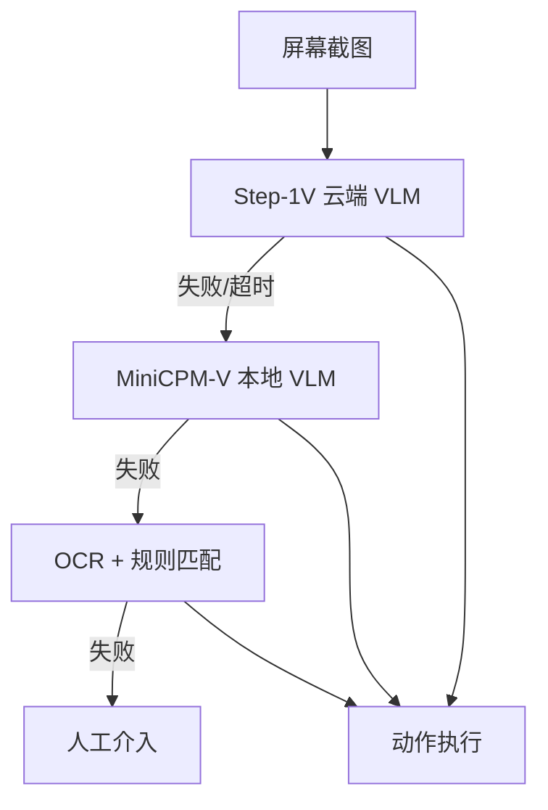
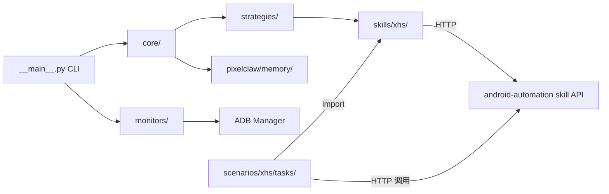

# PROJECTWIKI.md — PixelClaw

## 1. 项目概述

- **目标**：基于视觉识别的 Android 自动化系统，运行于 Raspberry Pi 5（aarch64）上，控制 Pixel 8a 完成小红书（XHS）、微信等 App 的自动化操作
- **背景**：通过 ADB + Shizuku 驱动设备，使用多级 VLM/OCR 策略分析屏幕并执行动作
- **运行环境**：Raspberry Pi 5 (aarch64) + Android Pixel 8a，Python 3.x
- **调用方式**：`python -m pixelclaw [subcommand]`

## 2. 架构设计

### 多级回退策略

### 整体模块关系

## 3. 架构决策记录（ADR）

- 目录：`docs/adr/`（待建立）
- 关键决策：使用 HTTP API (`http://localhost:18791/v1/skills/android-automation/execute`) 解耦任务脚本与核心包，部分老脚本使用 `sys.path.insert` 直接导入

## 4. 设计决策 & 技术债务

| 类型 | 描述 | 优先级 |
|------|------|--------|
| 技术债务 | `pixelclaw/memory/` 子包与项目根目录同名，命名混淆 | 低 |
| 技术债务 | `XHSAutomationSkill` 绕过 core ADBManager 直接调 subprocess | 低 |

## 5. 模块文档

| 模块 | 职责 |
|------|------|
| `core/` | 设备连接、视觉分析、动作执行核心逻辑 |
| `strategies/` | VLM/OCR 多级回退策略实现 |
| `monitors/` | ADB 管理、连接监控、Shizuku 权限管理 |
| `services/` | 保活服务 |
| `skills/xhs/` | 小红书（XHS）自动化 skill（UIAutomator 坐标驱动） |
| `scenarios/xhs/` | XHS 场景：任务脚本、工具脚本、文档 |
| `tasks/` | 通用任务脚本（微信、测试等） |
| `scripts/` | 通用环境安装与连接测试脚本 |
| `config/` | 设备与系统配置文件 |
| `docs/` | 通用项目文档 |
| `pixelclaw/memory/` | 三层记忆系统（capture → store → recall） |

## 6. API 手册

- **技能 API**：`POST http://localhost:18791/v1/skills/android-automation/execute`
- **入参**：`{"action": "<action_name>", ...kwargs}`
- **出参**：JSON 响应
- 详见 `docs/skill_usage.md`

## 7. 数据模型

- 设备配置：`config/devices.json`
- 系统设置：`config/settings.yaml`
- 记忆存储：见 `docs/MEMORY_SYSTEM_README.md`

## 8. 核心流程

CLI 入口：`python -m pixelclaw`

子命令：
- `--connect`：连接设备
- `--monitor`：启动连接监控
- `--task <name>`：执行指定任务
- `--interactive`：交互模式
- `--service`：守护进程模式

## 9. 依赖图谱

主要依赖见 `requirements.txt`。关键外部依赖：
- ADB（Android Debug Bridge）
- Shizuku（Android 权限管理）
- Step-1V API（云端 VLM）
- MiniCPM-V（本地 VLM，需 `scripts/install_minicpm.py` 安装）

## 10. 维护建议

- 任务脚本统一放入 `tasks/` 目录
- 文档统一放入 `docs/` 目录
- 新增策略在 `strategies/` 下继承 `base.py`

## 11. 术语表和缩写

| 术语 | 说明 |
|------|------|
| VLM | Vision Language Model，视觉语言模型 |
| ADB | Android Debug Bridge |
| XHS | 小红书（RedNote） |
| OCR | 光学字符识别 |
| MRE | Minimal Reproducible Example |

## 12. 变更日志

参见 [`CHANGELOG.md`](CHANGELOG.md)
