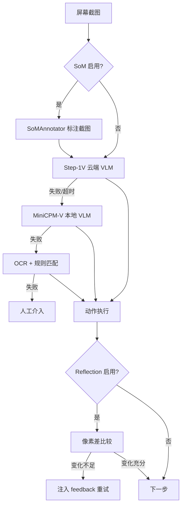
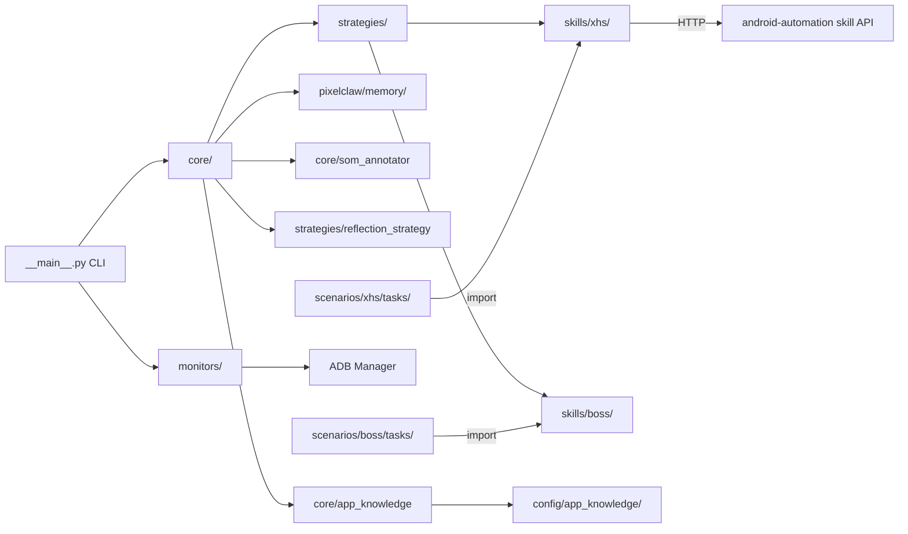
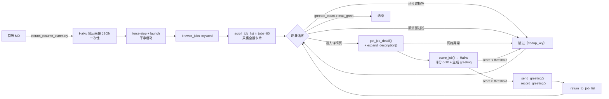
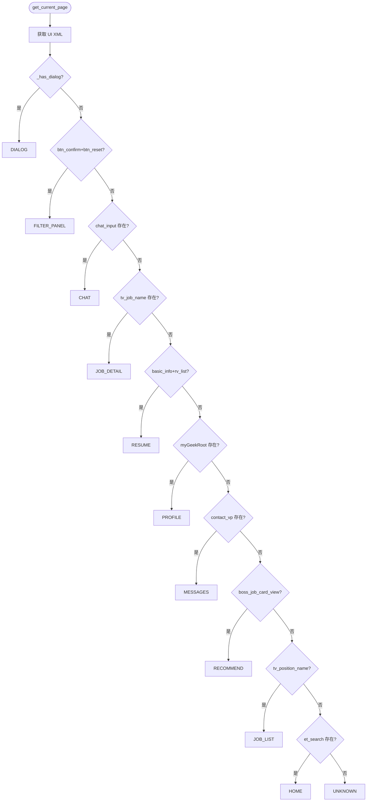
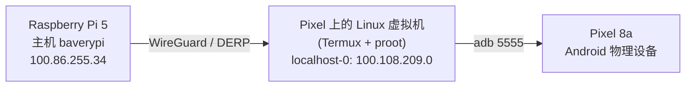
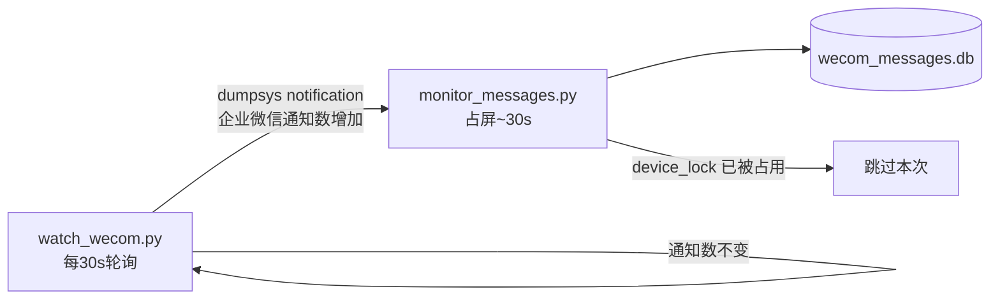

# PROJECTWIKI.md — PixelClaw

## 1. 项目概述

- **目标**：基于视觉识别的 Android 自动化系统，运行于 Raspberry Pi 5（aarch64）上，控制 Pixel 8a 完成小红书（XHS）、微信等 App 的自动化操作
- **背景**：通过 ADB + Shizuku 驱动设备，使用多级 VLM/OCR 策略分析屏幕并执行动作
- **运行环境**：Raspberry Pi 5 (aarch64) + Android Pixel 8a，Python 3.x
- **远程控制链路**：默认同一 WiFi 下走 §3 无线 ADB；2026-10 起支持 Tailscale 隧道（WireGuard）跨子网/跨公网远程控制物理 Pixel，ADB over WireGuard，无需 USB / 中转服务器（详见 §8.4.4）
- **调用方式**：`python -m pixelclaw [subcommand]`

## 2. 架构设计

### 多级回退策略（含 SoM + Reflection 扩展）


```mermaid
flowchart TD
    S[屏幕截图] --> SOM{SoM 启用?}
    SOM -->|是| ANN[SoMAnnotator 标注截图]
    SOM -->|否| V1
    ANN --> V1[Step-1V 云端 VLM]
    V1 -->|失败/超时| V2[MiniCPM-V 本地 VLM]
    V2 -->|失败| V3[OCR + 规则匹配]
    V3 -->|失败| V4[人工介入]
    V1 & V2 & V3 --> A[动作执行]
    A --> REF{Reflection 启用?}
    REF -->|是| DIFF[像素差比较]
    DIFF -->|变化不足| RETRY[注入 feedback 重试]
    REF -->|否| NEXT[下一步]
    DIFF -->|变化充分| NEXT
```

### 整体模块关系


```mermaid
flowchart LR
    CLI[__main__.py CLI] --> Core[core/]
    CLI --> Mon[monitors/]
    Core --> Strat[strategies/]
    Core --> Mem[pixelclaw/memory/]
    Core --> SOM[core/som_annotator]
    Core --> REF[strategies/reflection_strategy]
    Core --> AK[core/app_knowledge]
    Strat --> SkillXHS[skills/xhs/]
    Strat --> SkillBoss[skills/boss/]
    Mon --> ADB[ADB Manager]
    SkillXHS -->|HTTP| API[android-automation skill API]
    ScenXHS[scenarios/xhs/tasks/] -->|import| SkillXHS
    ScenBoss[scenarios/boss/tasks/] -->|import| SkillBoss
    AK --> Cfg[config/app_knowledge/]
```

## 3. 架构决策记录（ADR）

- 目录：`docs/adr/`（待建立）
- 关键决策：使用 HTTP API (`http://localhost:18791/v1/skills/android-automation/execute`) 解耦任务脚本与核心包，部分老脚本使用 `sys.path.insert` 直接导入

## 4. 设计决策 & 技术债务

| 类型 | 描述 | 优先级 |
|------|------|--------|
| 技术债务 | `pixelclaw/memory/` 子包与项目根目录同名，命名混淆 | 低 |
| 技术债务 | `XHSAutomationSkill` 绕过 core ADBManager 直接调 subprocess | 低 |
| 技术债务 | `apply_btn`（投递简历）resource-id 未在真机验证——直聘模式职位仅显示 btn_chat | 低 |
| 技术债务 | 消息页/聊天页额外功能区（发送图片/简历附件/面试邀请卡片）resource-id 未探索 | 低 |
| 技术债务 | 公司详情页（COMPANY_DETAIL）、投递记录页（APPLICATIONS）尚无真机 XML dump，PageState 识别依赖 inferred 元素 | 低 |
| 技术债务 | `test_reflection_strategy.py`：`Image.fromarray(arr, "RGB")` 的 `mode` 参数在 Pillow 13 弃用，届时需移除 | 低 |
| 技术债务 | `test_som_strategy.py`：`asyncio.get_event_loop()` 在 Python 3.10+ 无当前事件循环时触发 DeprecationWarning，建议改用 `asyncio.run()` | 低 |

## 5. 模块文档

| 模块 | 职责 |
|------|------|
| `core/` | 设备连接、视觉分析、动作执行核心逻辑 |
| `core/som_annotator.py` | SoM 标注器：将 UIAutomator XML 转为带编号截图 |
| `core/app_knowledge.py` | AppAgent 风格 App 知识库加载与 Prompt 注入 |
| `strategies/` | VLM/OCR 多级回退策略实现 |
| `strategies/reflection_strategy.py` | 像素差反思机制：判断动作是否生效 |
| `strategies/som_strategy.py` | SoM 策略包装器：解析 som_id 为真实坐标 |
| `monitors/` | ADB 管理、连接监控、Shizuku 权限管理 |
| `services/` | 保活服务 |
| `skills/xhs/` | 小红书（XHS）自动化 skill（UIAutomator 坐标驱动） |
| `skills/boss/` | Boss直聘自动化 skill（ADBManager 驱动） |
| `skills/linkedin/` | LinkedIn 自动化 skill（ADBRunner 驱动，Jetpack Compose SDUI） |
| `scenarios/xhs/` | XHS 场景：任务脚本、工具脚本、文档 |
| `scenarios/boss/` | Boss直聘场景：求职工作流、文档 |
| `scenarios/boss/scripts/scrape_job_details.py` | 职位详情爬虫：驱动 Boss直聘 App 滚动列表 → 进入详情 → 提取字段，爬取结果直写 `requirements.db` 的 `job_details` 表（`dedup_key UNIQUE` 全局去重），不再生成 JSON 文件 |
| `scenarios/boss/scripts/analyze_requirements.py` | 职位需求分析引擎：优先从 `job_details` 表读取（回落 JSON），LLM提取需求标签 → `requirements.db` 存储 → 频次/薪资/公司质量评分 → Markdown报告 |
| `scenarios/boss/scripts/smart_match_greet.py` | 简历匹配打招呼：单阶段 App 内实时循环（进详情页 → Haiku 实时评分 + 生成打招呼 → 达标立即发送）；`greetings` 表 + `dedup_key` 跨次去重；无需预爬数据库，直接实时运行 |
| `scenarios/boss/scripts/daily_greet.py` | 每日打招呼编排脚本：按顺序串联爬取→分析→评分发送三步；多关键词逐个处理；支持 `--skip-scrape`/`--skip-analyze`/`--score-only`/`--threshold`/`--strict`/`--max-greet` 等参数 |
| `scenarios/linkedin/scripts/ai_search_positioning.py` | LinkedIn AI 市场定位分析：deep link 搜索 → 多 result_type 滚动采集 → SQLite 去重 → Claude Haiku 分析 → Markdown 报告 |
| `scenarios/linkedin/config/positioning.yaml` | 定位分析配置：搜索查询列表（all/people/companies/content）、简历路径、采集参数 |
| `skills/wecom/` | 企业微信（WeCom）自动化 skill（UIAutomator + ctw 行容器解析） |
| `scenarios/wecom/` | 企业微信场景：消息监控工作流、配置、输出 |
| `scenarios/wecom/scripts/monitor_messages.py` | 消息监控脚本：搜索会话 → UIAutomator dump → ctw 行解析 → 时间继承 → SQLite 去重写入；`--dry-run` 仅打印不写库 |
| `scenarios/wecom/scripts/watch_wecom.py` | 轻量通知触发器：每 30s 轮询 `dumpsys notification`，有新通知时才触发 monitor_messages.py；不占用手机屏幕 |
| `config/app_knowledge/wecom.json` | 企业微信 UI 元素知识库（2026-09 app update 后，9 个 element） |
| `config/app_knowledge/` | 各 App 的 AppAgent 格式知识库 JSON |
| `tasks/` | 通用任务脚本（微信、测试等） |
| `scripts/` | 通用环境安装与连接测试脚本 |
| `config/devices.json` | 设备配置（当前默认：Raspberry Pi 5 主机档） |
| `config/devices.raspberrypi.example.json` | Pi 5 主机档参考快照（用于跨档位切换） |
| `config/devices.windows.example.json` | Windows 主机档参考快照（历史/默认占位，2026-10 起已不维护） |
| `config/mihomo-config-snapshot.yaml` | mihomo (Clash Meta) 配置归档（脱敏版，2026-10-09）——保留 100.64.0.0/10 tailnet 直连规则 |
| `config/` | 设备与系统配置文件 |
| `docs/` | 通用项目文档 |
| `memory/` | 三层记忆系统（capture → store → recall） |
| `pixelclaw` (项目根 launcher) | `os.chdir(parent)` 后调 `python -m pixelclaw <args>`，从任意目录运行 |
| `tests/` | 单元测试（pytest，193 tests，无真机依赖） |

### WeCom 数据库 Schema（`scenarios/wecom/output/wecom_messages.db`）

| 表 | 用途 | 主键 / 唯一约束 |
|----|------|----------------|
| `messages` | 企业微信聊天消息 | `id` PK；`msg_hash UNIQUE = SHA-256(contact\|sender\|text\|time_str)` |

`messages` 字段：`id, contact, sender, time_str, text, url, msg_hash, first_seen_at`

- `contact`：联系人或群名（来自 contacts.yaml）
- `time_str`：消息显示时间（如「昨天 21:20」）；无独立时间戳的消息继承上一条已知时间（前向传播），首批消息向后借用第一个已知时间
- `url`：卡片消息外部链接（默认空；`fetch_card_urls=True` 时点击卡片提取）
- `msg_hash`：跨次运行全局去重，`IntegrityError` = 已存在，静默跳过

### Boss 数据库 Schema（`scenarios/boss/output/requirements.db`）

| 表 | 用途 | 主键 / 唯一约束 |
|----|------|----------------|
| `job_details` | 原始爬取数据（详情表） | `dedup_key UNIQUE = normalize_card_title(title)\tcompany\thr_name` |
| `jobs` | LLM 分析元数据（分析表） | `source_file + job_index`；`job_details_id` FK → `job_details.id` |
| `requirements` | LLM 提取的需求标签 | `job_id` FK → `jobs.id` |
| `greetings` | 打招呼发送记录（去重用） | `id` PK；`job_details_id` FK → `job_details.id`；字段：`keyword`, `greeting_text`, `sent_at`, `action` |

### BOSSAutomationSkill 详细说明（`skills/boss/boss_automation_skill.py`）

**导出常量类**：

| 类 | 用途 |
|----|------|
| `PageState` | 页面状态字符串常量：`HOME / JOB_LIST / JOB_DETAIL / CHAT / DIALOG / UNKNOWN / RECOMMEND / MESSAGES / PROFILE / FILTER_PANEL / COMPANY_DETAIL / RESUME / APPLICATIONS` |
| `DialogType` | 弹窗类型常量：`DAILY_LIMIT / LOGIN_REQUIRED / JOB_OFFLINE / EXISTING_CHAT / DISMISSED / NONE / UNKNOWN_DIALOG / WARM_REMINDER` |
| `ChatEntry` | 消息列表条目 dataclass：`hr_name / position / last_msg / time_str / tap_x / tap_y` |

**JobInfo 数据类**（`@dataclass`）：

| 字段 | 类型 | 说明 |
|------|------|------|
| `title` | `str` | 职位名称（`tv_position_name`） |
| `company` | `str` | 公司名称（`tv_company_name`，已验证） |
| `salary` | `str` | 薪资范围（`tv_salary_statue`，已验证） |
| `location` | `str` | 工作地点（`tv_distance`，已验证；详情页才是 `tv_location`） |
| `hr_name` | `str` | HR 姓名（`tv_employer` 按 `·` 拆分前段，已验证） |
| `hr_title` | `str` | HR 职位（`tv_employer` 按 `·` 拆分后段，已验证） |
| `hr_active` | `str` | HR 活跃状态；**列表卡不含此字段，恒为空**，需进详情页获取 |
| `tap_x/tap_y` | `int` | 职位卡片中心坐标（由 `get_job_list()` 采集） |
| `raw` | `dict` | 原始附加数据 |

> **卡片层级陷阱**：`tv_position_name` 的直接父节点 `cl_position` 仅含标题，字段容器是再上一层的 `view_job_card`。`get_job_list()` 需向上遍历至多 5 层定位该容器，否则除 `title` 外全部为空。详见 `scenarios/boss/docs/atomic_operations.md` §4.1

> **异步角标陷阱**：列表卡标题尾部可能带 `" &@ "` 占位字符（异步加载的角标 span），同一张卡在不同 dump 中可能带也可能不带，直接按原文去重会把同一职位当成两条。统一用 `normalize_card_title()` 归一化后再作为身份键。

> **边缘卡片回收陷阱**：位于视口边缘的卡片会被 RecyclerView 部分回收，只渲染出 `title`，`company` / `location` / `hr_*` 全为空。补救方式是小步滚动后**重新 dump**——滚动会让 `tap_x/tap_y` 失效，绝不能复用滚动前的 `JobInfo` 对象。

> **公司名截断陷阱**：App 职位列表卡片显示的 `job.company` 是截断版（如 `"原点星辉"`），而数据库中爬取时存储的是完整工商名（如 `"上海原点星辉科学技术有限公司"`）。`smart_match_greet.py` 的单阶段架构已彻底消除此问题——不再跨源（DB→App）做匹配，所有数据均来自同一次实时 App 详情页提取，`dedup_key` 也基于实时采集到的 title/company 生成。若仍有脚本需要在 live 卡片与 DB 记录之间匹配，**禁止使用精确字符串相等**，应用 `title 包含匹配 + company[:6] 前缀重叠`。

**关键方法**：

| 方法 | 签名 | 说明 |
|------|------|------|
| `get_current_page` | `(xml=None) -> str` | 返回 `PageState.*`；检测优先级：dialog > filter_panel > chat > job_detail > resume > profile > messages > recommend > job_list > home > unknown |
| `detect_dialog` | `(xml=None) -> str` | 返回 `DialogType.*`；通过文本包含匹配识别弹窗类型 |
| `dismiss_dialog` | `(dialog_type, xml=None) -> bool` | 按类型关闭弹窗：点确认按钮 / press_back / 无操作 |
| `get_job_list` | `(xml=None) -> List[JobInfo]` | 解析列表页，每个职位记录坐标 + 公司/薪资/地点/HR；通过 parent-map 兄弟节点遍历 |
| `navigate_to_job` | `(job: JobInfo) -> bool` | 使用 `job.tap_x/tap_y` 坐标直接点击，避免导航死循环 |
| `scroll_job_list` | `(n_jobs, max_scrolls=10) -> List[JobInfo]` | 滚动加载直至达到 n_jobs 或无新职位；按 `normalize_card_title()` 归一化后的 title 去重，同一卡片再次出现时补齐首次为空的字段 |
| `normalize_card_title` | `(title: str) -> str`（模块级函数） | 去掉列表卡标题尾部的异步角标占位符（形如 `" &@ "`），使同一卡片可稳定去重；标题中间的 `&` / `@` 不受影响 |
| `navigate_to_tab` | `(tab: str) -> bool` | 切换底部导航 Tab（'recommend'/'jobs'/'messages'/'profile'）；通过 tv_tab_N 文本匹配 + cl_tab_N 点击 |
| `get_message_list` | `(xml=None) -> List[ChatEntry]` | 解析消息 Tab 联系人列表；每条含 hr_name/position/last_msg/time_str 及点击坐标 |
| `navigate_to_chat` | `(entry: ChatEntry) -> bool` | 用 ChatEntry 坐标进入已有聊天记录 |
| `set_filter` | `(salary, experience, education, city) -> bool` | 在已打开的筛选面板中按文本点击选项并确认（优先用 btn_confirm resource-id） |
| `wait_for_element` | `(resource_id, timeout=5.0, interval=0.5)` | 轮询 UI 直到元素出现或超时 |
| `ensure_ready` | `() -> bool` | 迭代前健康检查：ADB → 屏幕 → App 前台 → 弹窗清理；返回 False 表示无法自动恢复 |
| `_is_screen_on` | `() -> bool` | 通过 `dumpsys power mWakefulness=Awake` 检测屏幕状态 |
| `_wake_screen` | `() -> None` | 发送 KEYCODE_WAKEUP (224) 唤醒屏幕 |
| `can_apply` | `() -> bool` | 检测当前页是否有 `btn_apply` 按钮 |
| `apply_to_job` | `() -> bool` | 若无按钮立即返回 False |
| `send_greeting` | `(message, verify=False) -> bool` | 发送消息；verify=True 时调用 `verify_message_sent` 确认 |
| `verify_message_sent` | `(message, timeout=3.0) -> bool` | 轮询聊天气泡确认消息已发出 |

**推荐工作流（两阶段）**：

Boss直聘平台规定，只有双方都发过消息后，聊天页才会出现"投递简历"按钮。因此求职流程分两个阶段执行：

| 阶段 | 脚本 | 操作 | 前提 |
|------|------|------|------|
| 第一阶段 | `boss_greet_task.py` | 搜索职位 → 逐个发打招呼（立即沟通） | 无 |
| 等待 | — | 等待数小时至一天，HR 陆续回复 | — |
| 第二阶段 | `boss_apply_task.py` | 消息Tab → `get_message_list()` → `navigate_to_chat()` → `can_apply()` → `apply_to_job()` | HR 已回复 |

### smart_match_greet.py — 简历匹配评分 + 个性化打招呼

**脚本路径**：`scenarios/boss/scripts/smart_match_greet.py`

比 `boss_greet_task.py` 更精准的打招呼方案：**单阶段 App 内实时循环**——无需预爬数据库，直接驱动 Boss直聘 App，逐条进入职位详情页提取完整 JD，Haiku 实时评分 + 生成量身定制问候，达标立即发送，`greetings` 表记录已发送职位，跨次运行自动跳过。日常通过 `daily_greet.py` 编排三步流程一键运行。

**单阶段流程**：


```mermaid
flowchart LR
    Resume[简历 MD] -->|extract_resume_summary| Portrait[Haiku 简历画像 JSON\n一次性]
    Portrait --> Start[force-stop + launch\n干净启动]
    Start --> Browse[browse_jobs keyword]
    Browse --> Scroll[scroll_job_list n_jobs=60\n采集全量卡片]
    Scroll --> Loop{逐条循环}
    Loop -->|已打过招呼| Skip[跳过（dedup_key）]
    Loop -->|薪资预过滤| Skip
    Loop -->|进入详情页| Detail["get_job_detail()\n+ expand_description()"]
    Detail -->|网络异常| Skip
    Detail --> Score["score_job() → Haiku\n评分 0-10 + 生成 greeting"]
    Score -->|score < threshold| Skip
    Score -->|score ≥ threshold| Send["send_greeting()\n_record_greeting()"]
    Send --> Return[_return_to_job_list]
    Return --> Loop
    Loop -->|greeted_count ≥ max_greet| Stop[结束]
    Skip --> Loop
```

**关键设计决策**：

| 决策 | 做法 | 原因 |
|------|------|------|
| 单阶段 vs 两阶段 | 单阶段：App 内实时循环，所有数据来自详情页 | 消除 DB 全名 vs App 截断公司名的跨源匹配问题，无需 `_find_greeting()` 模糊匹配 |
| `am force-stop` 启动前 | 强制停止 App 再启动 | `launch()` 只 bring-to-foreground，不重置导航状态；停留在详情/聊天页时 `browse_jobs()` 会失败 |
| `_return_to_job_list` 调用时机 | 仅 `greeted_count > 0` 后才调用 | 仍在职位列表时调用会触发无效 back，导致"无法返回职位列表"错误 |
| 简历预处理 | `extract_resume_summary()` 调一次 Haiku → 结构化 JSON | 避免每个职位都传 12k 字全文，同时确保关键信息不被截断 |
| 去重 dedup_key | `normalize_card_title(title)\tcompany\thr_name` | 唯一标识一条职位；首次打招呼时 `INSERT OR IGNORE INTO job_details`，无需预爬记录 |
| `--score-only` 模式 | 仍需打开 App | 评分依赖实时 JD 文本，不再是离线操作 |

**CLI 参数**：

```
--keyword   搜索关键词（必填）
--threshold 最低匹配分数 0-10（默认 6）
--max-greet 最多发送打招呼数（默认 5）
--strict    严格评分模式（不明确要求 AI/Agent 经验的职位不超过 8 分）
--score-only 仅评分打印，不发送（但仍需打开 App）
--min-salary 月薪下限（K），低于此值在评分前跳过
--no-verify  发送后不验证消息已发出
--device    ADB 设备 serial
```

**典型运行**：
```bash
# 仅评分验证
python scenarios/boss/scripts/smart_match_greet.py --keyword "AI产品经理" --score-only --strict

# 发 1 条（调试）
python scenarios/boss/scripts/smart_match_greet.py --keyword "AI产品经理" --max-greet 1 --threshold 8 --strict

# 正式运行
python scenarios/boss/scripts/smart_match_greet.py --keyword "AI产品经理" --threshold 7 --strict
```

**LLM Provider 配置（Anthropic SDK 兼容，2026-10-09 修复）**：

`smart_match_greet.py` 用 `anthropic.Anthropic` SDK（`_make_client()` 见代码；`load_dotenv(REPO_ROOT/".env", override=True)`），需要外部 Anthropic 兼容 endpoint。当前默认主选 **hermes（MiniMax）**：

```bash
# .env（项目根；.env.example 同仓）
ANTHROPIC_API_KEY=<MINIMAX_CN_API_KEY，从 printenv 取值>
ANTHROPIC_BASE_URL=https://api.minimaxi.com/anthropic
ANTHROPIC_BACKUP_API_KEY=             # 不设则 fallback 不启用
ANTHROPIC_BACKUP_BASE_URL=
```

| Provider | URL | 模型 | 备注 |
|---|---|---|---|
| **hermes（默认主）** | `https://api.minimaxi.com/anthropic` | `MiniMax-M3` | 实测 2-3s/请求；2.5 分钟内完成 2-job 实测循环 |
| `claude-haiku-4-5-20251001` | 同 URL | 备选标准 Claude 名 | 兼容 MiniMax-M3 暂时不可用时 |
| klugai（已弃，2026-10） | `https://www.klugai.lol/api` | `claude-*` | klugai 不支持 `MiniMax-M3`，会 `model_not_found` |

> ⚠️ **域名陷阱**：MiniMax 有一对相似但不同的域名——
> - `api.minimax.chat/v1` —— OpenAI-Completions 协议（openclaw `minimax-custom` / `custom-minnimax-chat` provider 用的）
> - `api.minimaxi.com/anthropic` —— Anthropic-Messages 协议（openclaw `minimax` provider 用的）
>
> Anthropic SDK 配前者会持续 404，部分实现会 hang，让外部观察者误以为是"LLM 慢"。**诊断套路**：先用一个 30s 超时的裸 SDK 测一次 `messages.create(model="MiniMax-M3", max_tokens=16, ...)`——5s 内拿到 200/401/404 都是健康的；30s 才出说明 URL 错了。详见项目 memory `reference_hermes_llm_endpoint.md`。

**实测（2026-10-09 修复后）**：`--max-greet 1 --keyword "AI产品经理"` 用时 2 分 40 秒，1 个职位打招呼成功（AI native 产品经理【GEO方向】/PureblueAI，7/10），1 个跳过（AIoT生态产品经理 6 分 < 7）。

**简历路径解析（2026-10-09 新增）**：跨主机档（Pi 5 vs Windows）共用脚本时不希望硬编码 Windows 路径。三个 sister 脚本（`scenarios/{boss,zhilian,liepin}/scripts/smart_match_greet.py`）的 `RESUME_DEFAULT` 解析顺序：

1. `$PIXELCLAW_RESUME_PATH` 环境变量（`.env` 或系统 env）
2. Pi 默认回退：`~$HOME/Projects/resume-renew/resume/current.md`

```python
# 实际写法（注意空字符串按"未设"处理，落到 Pi 回退）
import os as _os_for_default
RESUME_DEFAULT = Path(
    _os_for_default.environ.get("PIXELCLAW_RESUME_PATH")
    or str(Path.home() / "Projects" / "resume-renew" / "resume" / "current.md")
)
```

主机档切换方法：
- Windows：`.env` 里设 `PIXELCLAW_RESUME_PATH=C:/Dev/projects/resume-renew/resume/current.md`
- Pi：不设，自动走回退路径

`.env.example` 已同步加 `PIXELCLAW_RESUME_PATH=` 占位行。

**已知限制**：
- `verify_send=True` 的"发送未确认"不代表失败——消息可能已发出，但 `verify_message_sent()` 轮询窗口内未抓到气泡
- 详情页加载超时（偶发网络抖动）会跳过该职位并继续下一个
- 列表页 `scroll_job_list` 采集坐标后再导航会因滚动偏移而坐标漂移；实测 n_jobs=60 在采集完成后立即循环，暂未发现问题

**Agent 引导 skill（2026-10 新增）**：完整工作流 + preflight + 3 平台差异 + 8+ 错误→修复已封装为 Claude skill，位于 `.claude/skills/smart-greet/SKILL.md`。用户说"智能打招呼"、"匹配职位"、"发送未确认是不是失败了"、"切到智联"等都会自动触发。Skill 包含：
- 5 项 preflight 检查（ADB / .env / 简历 / LLM endpoint 30s 诊断 / App 已登录）
- 跨平台命令模板（boss/zhilian/liepin 各举 1 例）
- `references/error-fix-table.md`（12 行错误→修复，含严重程度 P0/P1/P2 分级）
- `references/platform-differences.md`（3 平台 9 维度详细对比：打招呼机制 / Dialog / HR 活跃度 / 薪资 / DB / 上限 / Prompt / 入口模式 / 共享 vs 平台特有）
- `scripts/preflight.sh`（一键 5 项 preflight，4.4 KB）
- `scripts/diagnose-fail.sh`（错误关键词匹配 12 类，4.4 KB）
- `evals/evals.json`（5 个 test cases for skill-creator eval 循环）

个人级通用版（不带 PixelClaw 命令路径）见 `~/.claude/skills/job-greet/SKILL.md`。

**Boss直聘页面状态检测流程**（13 种状态）：


```mermaid
flowchart TD
    start([get_current_page]) --> xml[获取 UI XML]
    xml --> D{_has_dialog?}
    D -->|是| PD[DIALOG]
    D -->|否| FP{btn_confirm+btn_reset?}
    FP -->|是| PFP[FILTER_PANEL]
    FP -->|否| C{chat_input 存在?}
    C -->|是| PC[CHAT]
    C -->|否| JD{tv_job_name 存在?}
    JD -->|是| PJD[JOB_DETAIL]
    JD -->|否| RS{basic_info+rv_list?}
    RS -->|是| PRS[RESUME]
    RS -->|否| PR{myGeekRoot 存在?}
    PR -->|是| PPR[PROFILE]
    PR -->|否| MSG{contact_vp 存在?}
    MSG -->|是| PMSG[MESSAGES]
    MSG -->|否| REC{boss_job_card_view?}
    REC -->|是| PREC[RECOMMEND]
    REC -->|否| JL{tv_position_name?}
    JL -->|是| PJL[JOB_LIST]
    JL -->|否| H{et_search 存在?}
    H -->|是| PH[HOME]
    H -->|否| PU[UNKNOWN]
```

**弹窗检测机制**（`DialogType._SIGNATURES`）：

弹窗无固定 `resource-id`，通过遍历所有节点 `text` 属性做 `in` 包含匹配：

| 关键词 | 类型 |
|--------|------|
| `"免费沟通名额已使用完"` / `"今日免费沟通"` / `"名额已用"` | `DAILY_LIMIT` |
| `"立即登录"` / `"请登录后操作"` | `LOGIN_REQUIRED` |
| `"该职位已下线"` / `"职位已下线"` / `"暂停招聘"` | `JOB_OFFLINE` |
| `"已和对方建立沟通"` | `EXISTING_CHAT` |
| `"温馨提示"` | `WARM_REMINDER`（点击「立即沟通」后的确认弹窗，dismiss 后继续发送） |

**navigation bug 修复说明**（ADR-202509-boss-nav）：
- **问题**：原 `tap_element("job_name")` 永远点第一个 `tv_position_name` 节点，多职位迭代时死循环
- **修复**：`get_job_list()` 捕获每个节点的 bounds 中心坐标存入 `job.tap_x/tap_y`，`navigate_to_job(job)` 直接 `adb.tap(job.tap_x, job.tap_y)`
- **影响**：仅 `BOSSAutomationSkill` 内部；向外暴露 `navigate_to_job(job)` 替换原 `tap_element("job_name")`

## 6. API 手册

- **技能 API**：`POST http://localhost:18791/v1/skills/android-automation/execute`
- **入参**：`{"action": "<action_name>", ...kwargs}`
- **出参**：JSON 响应
- 详见 `docs/skill_usage.md`

### 调试 API（跨环境日志）

| 端点 | 方法 | 说明 |
|------|------|------|
| `/api/log` | POST | 接收外部日志并写入 `logs/autox_debug/` |
| `/api/log/files` | GET | 列出可用日志文件 |
| `/api/log/files/{filename}` | GET | 读取指定日志文件内容 |

**POST /api/log** 入参示例：
```json
{
  "level": "ERROR",
  "message": "操作失败",
  "source": "autox",
  "stack_trace": "Error: test\n at test.js:10",
  "context": {"device": "Pixel 8a"}
}
```

## 7. 数据模型

- 设备配置：`config/devices.json`（当前 Pi 5 主机档）；备查：`config/devices.raspberrypi.example.json` / `config/devices.windows.example.json`
- 系统设置：`config/settings.yaml`
- 记忆存储：见 `docs/MEMORY_SYSTEM_README.md`

## 8. 核心流程

CLI 入口：`./pixelclaw <args>`（项目根目录下的 launcher 脚本）或从项目根父目录执行 `python -m pixelclaw <args>`

子命令：
- `--connect`：连接设备
- `--monitor`：启动连接监控
- `--task <name>`：执行指定任务
- `--interactive`：交互模式
- `--service`：守护进程模式
- `--service --status`：查看守护进程状态
- `--service --stop`：停止守护进程

完整使用指南：[docs/GETTING_STARTED.md](docs/GETTING_STARTED.md)

### 8.4 设备连接与 Keepalive 服务

#### 8.4.1 无线 ADB 三端口关系

Pixel 8a 在 Android 11+ 无线调试场景下涉及三类网络地址，**三者不能混用**：

| 角色 | 字段（`config/devices.json`） | 生命周期 | 示例（Pi 5 实测） |
|---|---|---|---|
| 配对地址 | `ip` + `pairing_port` | 每次「使用配对码配对」对话框刷新即变（~30s 过期） | `10.32.7.125:36111` |
| 配对码 | `pairing_code` | 同上 | `988963` |
| 接入地址 | `ip` + `port` | 配对成功后手机端新开的 ADB 监听端口；只要无线调试保持开启就稳定 | `10.32.7.125:42527` |

工作流：
1. 手机「设置 → 系统 → 开发者选项 → 无线调试 → 使用配对码配对」会显示「IP address & Port」和「Pairing code」
2. 把 IP/配对端口/配对码写入 `config/devices.json`
3. `adb pair <ip>:<pairing_port> <pairing_code>` — 手机弹出「允许 USB 调试」需点同意
4. `adb connect <ip>:<port>` — 此时「接入端口」才真正暴露（往往是 5 位随机端口，与配对端口不同）

> ⚠️ 真实 IP 取决于主机和手机当前所在的 WiFi 子网，**不是固定值**。本次实测 Pi 在 `10.32.7.0/24`，手机 `10.32.7.125`。换网或换手机时必须重新确认。

#### 8.4.1a 主机档位：Pi 5 vs Windows（历史）

`config/devices.json` 当前是 **Raspberry Pi 5** 主机档（2026-10 起的实际运行环境）；**Windows** 主机档已不再维护，仅在 `config/devices.windows.example.json` 保留为参考。两套值差异如下：

| 主机 | 档位文件 | `ip` | `port` | `pairing_port` | `pairing_code` |
|---|---|---|---|---|---|
| **Raspberry Pi 5**（当前默认） | `config/devices.json` | `10.32.7.125` | `42527` | `36111` | `988963` |
| **Windows**（历史） | `config/devices.windows.example.json` | `172.19.0.1` | `45373` | `null`（回退 `port`） | `444047` |

切换主机档：
```bash
# 切到 Windows 档
cp config/devices.json config/devices.raspberrypi.json.bak
cp config/devices.windows.example.json config/devices.json
# 改 IP / 配对码（Windows 上 Pi 的值会变；反之亦然）

# 切回 Pi 档
cp config/devices.json config/devices.windows.json.bak
cp config/devices.raspberrypi.example.json config/devices.json
# 改 IP / 配对码
```

**`pairing_port: null` 的回退行为**：Windows 档的历史值 `pairing_port=null`，`DeviceConnector.pair()` 内部检测到缺失时回退使用 `port`（即 `45373`）。这是 2026-10 之前的行为，**未经 Android 11+ 实测**——若配对失败，先临时把 `pairing_port` 写成手机屏幕显示的端口。

#### 8.4.2 Keepalive 服务架构

`./pixelclaw --service` 启动后由三层组成：

```
┌──────────────────────────────────────────────────┐
│ KeepaliveService  (services/keepalive_service.py) │
│   • PID: /tmp/pixelclaw_keepalive.pid             │
│   • 日志: logs/keepalive.log                      │
│   • 状态: logs/keepalive_status.json              │
│   • 周期: 30s 健康检查；每 10 次保存状态           │
└──────────────┬───────────────────────────────────┘
               │
               ▼
┌──────────────────────────────────────────────────┐
│ ConnectionMonitor  (monitors/connection_monitor.py)│
│   • 健康检查: is_device_connected() + adb shell   │
│   • 自动重连: 指数退避，max_reconnect_attempts=10 │
└──────────────┬───────────────────────────────────┘
               │
               ▼
┌──────────────────────────────────────────────────┐
│ ADBManager  (monitors/adb_manager.py)            │
│   • adb pair / adb connect 封装                    │
│   • shell / screenshot / input 等原子操作          │
└──────────────────────────────────────────────────┘
```

异常路径：
- 健康检查失败 → 记录 reconnect 计数 → 调 `monitor.connect()` 重连 → 成功/失败分别记 INFO/ERROR
- 收到 SIGTERM/SIGINT → 写 PID 清理 → 打印 uptime/health_checks/reconnections 总览

#### 8.4.3 CLI 入口与 launcher 脚本

`python -m pixelclaw` 的运行条件：CWD 必须是 `pixelclaw/` 的父目录（即 `/home/averypi/Projects/`），因为 Python 沿 `sys.path` 找名为 `pixelclaw` 的子目录。**从项目根 `/home/averypi/Projects/pixelclaw/` 直接 `python -m pixelclaw` 会失败**（找不到 `pixelclaw/` 子目录）。

解决方案：项目根的 `pixelclaw` launcher 脚本内部 `os.chdir(parent)` 后再调 `python -m pixelclaw`，让用户无论在哪个目录都能用 `./pixelclaw --xxx` 形式调用。

`__main__.py` 的两个内部优化支撑 `--service` / `--monitor` 不需要重型依赖：
1. 文件首部把项目根 + 父目录 push 进 `sys.path`，兼容 `python __main__.py` 直跑
2. `VisionAgent` / `FallbackManager` 改为在 `cmd_task` / `cmd_interactive` 内 lazy import（这两个会触发 `cv2` / `torch` import）

历史包袱：2026-10 之前 `__main__.py` 顶层 `from .core.vision_agent import VisionAgent`，启动 `--service` 也会被迫加载 cv2；同期项目根还有一个空的 inner `pixelclaw/` 命名空间包（仅 `memory/` 有真实代码），遮蔽外层 `pixelclaw` package，导致 `python -m pixelclaw` 报 `No module named pixelclaw.__main__`。本次修复已把 inner 目录删除、`memory/` 移至根。

### 8.4.4 Tailscale 远程控制链路（2026-10 新增）

§8.4.1–§8.4.3 描述的无线 ADB 配对要求 Pi 与 Pixel 在同一 WiFi 子网（如 `10.32.7.0/24`）。当两者不在同一网络（甚至跨公网）时，通过 Tailscale 把 Pixel 上的 Linux 虚拟机暴露进同一 tailnet，ADB over WireGuard 隧道即可远程控制。

**拓扑**：


```mermaid
flowchart LR
    Pi["Raspberry Pi 5<br/>主机 baverypi<br/>100.86.255.34"] -->|WireGuard / DERP| VM["Pixel 上的 Linux 虚拟机<br/>(Termux + proot)<br/>localhost-0: 100.108.209.0"]
    VM -->|adb 5555| Phone["Pixel 8a<br/>Android 物理设备"]
```

**链路组件**：
- **Pi 主机**：tailnet 节点 `baverypi`（`100.86.255.34`），执行所有 ADB 客户端命令
- **Pixel 上的 Linux 虚拟机**：Termux + `proot-distro`（Debian/Ubuntu）跑出的用户态 Linux 环境，安装并登录 Tailscale → 暴露为 tailnet 节点 `localhost-0`（`100.108.209.0`）
- **虚拟机内 ADB 服务**：监听 `0.0.0.0:5555`（Android 11+ `adb tcpip 5555` 即可）
- **Tailscale 隧道**：WireGuard 建立 P2P 连接（NAT 穿透成功）；跨子网/对称 NAT 失败时回落 DERP 中继

**连接命令**：

```bash
# 在 Pi 主机执行（不受子网约束）
adb connect 100.108.209.0:5555

# 验证
adb devices -l
# 预期: 100.108.209.0:5555    device product:akita model:Pixel_8a ...

# 启动 App 并截图（实测可工作）
adb shell am start -n com.tencent.mm/com.tencent.mm.ui.LauncherUI
adb exec-out screencap -p > wechat.png
```

**关键优势**：
- **跨子网/跨公网**：Pi 与 Pixel 不必在同一 WiFi（公司 + 家庭、跨城、出差）
- **免 USB**：完全脱离物理连接
- **免中转**：NAT 穿透成功时 P2P；失败走 Tailscale 自带 DERP 中继（仍免自建）
- **加密**：ADB 流量走 WireGuard，链路层加密

**与 §8.4.1 关系**：Tailscale 链路是「同一 WiFi 无线 ADB」的**超集**——两者可同时存在，按场景切换：
- 同一 WiFi 优先走 `10.32.7.125:42527`（延迟更低）
- 不在同一网络走 `100.108.209.0:5555`（跨子网/跨公网）

**实测验证（2026-10-09）**：
- 主机：Pi 5（`baverypi`，`100.86.255.34`）
- Pixel 节点：`localhost-0`（`100.108.209.0`）
- 操作序列：`adb connect 100.108.209.0:5555` → `am start com.tencent.mm/.ui.LauncherUI` → `exec-out screencap -p > wechat.png`
- 结果：截图成功（1080×2400 PNG，157 KB），内容为微信主界面，时间戳 23:58 与主机时间一致

**配置建议**：
- `config/devices.json` 当前仅存 WiFi 内网值；tailnet 远程链路可作为**应急备份**——主用 WiFi 链路不可达时（如换网/出远门），临时 `adb connect <tailnet_ip>:5555` 即可接管
- 后续可考虑在 `config/devices.json` 增加 `tailscale_ip` / `tailscale_port` 字段，`DeviceConnector.connect()` 增加 tailnet 兜底分支

用户操作指引见 `docs/GETTING_STARTED.md` §3.11。

> ⚠️ **本节状态备注（2026-10-09 更新）**：本节链路依赖 Pixel AVF Linux VM（Android Terminal app 启动的 Debian AVF 镜像）作为 tailscaled + socat 宿主。多次会话验证表明 AVF VM 稳定性差——单次终端 session 撑不了几小时就崩溃、tailscaled + socat 全部丢失；而且 VM state 是 ephemeral 的，session 之间丢失 tailscaled 二进制，每次 session 起都得重 `apt install tailscale` + 重 `tailscale up`（每次都要点浏览器 auth URL），运维摩擦过大。**当前生产路径仍走 §3 同 WiFi 无线 ADB（`10.32.7.105:5555`，与 Pi 同在 `10.32.7.0/24` 子网，延迟 1–2 ms）**；本节作为跨子网/跨公网场景的参考实现保留，待找到稳定的 VM/容器方案后（例如 Pixel 主 Android 装 Tailscale + SSH-tunnel transport 而非 WireGuard-VPN，避免 `VpnService` 单槽冲突）再考虑投入生产。

> ⚠️ **mihomo/Tailscale 共存坑（2026-10 实测）**：Tailscale 装好后若发现 GitHub raw 掉到 4 KB/s、apt 装包 28 KB/s、整网速被代理拖垮，几乎一定是 Tailscale CGNAT 段 `100.64.0.0/10` 没在 mihomo 白名单——包走 mihomo 出网，mihomo 又没有去 tailnet 的路由，引发回环。同时首次启用 subnet router 模式时还会因 `ip_forward=0` / IPv6 forwarding off 报 `netcheck: IPv4 UDP disabled`。**必须在装 Tailscale 当天就检查并修复**，否则整个开发体验会不可解释地变慢。完整诊断 + 三步修复见 §8.4.5。

### 8.4.5 Mihomo/Tailscale 共存配置（2026-10 修复）

本节是 §8.4.4「Tailscale 远程控制链路」的**配套排障章节**——链路本身测通了，但「装了 Tailscale 之后整网变慢」的根因是 mihomo 代理 + Tailscale CGNAT 段 + IP 转发的三方冲突，单独处理任一项都不彻底。

**冲突根因（三个独立坑，必须全部修）**：

| # | 坑 | 现象 | 根因 |
|---|----|------|------|
| 1 | Tailscale CGNAT 段被代理吃 | GitHub raw 4 KB/s、apt 装包 28 KB /s、境外 HTTPS 普遍卡顿；`tailscale status` 显示 `localhost-0` 长期 `relay "hkg"`（走 DERP 中继） | mihomo 默认 rules 只放行 RFC1918（`10.0.0.0/8` / `172.16.0.0/12` / `192.168.0.0/16`），Tailscale 的 CGNAT 段 `100.64.0.0/10` 不在内，tailnet 流量也被强制走 mihomo 出网；mihomo 又没有到 tailnet 的路由，引发回环 / 代理握手挂死 |
| 2 | IP 转发未启用 | `tailscaled` 日志反复 `netcheck: IPv4 UDP disabled` / `ipv6 forwarding is off`；`tailscale status` 出现 `subnet router` 警告 | Tailscale subnet router 模式要求内核允许 IPv4/IPv6 转发；Pi 5 默认 `net.ipv4.ip_forward=0` |
| 3 | mihomo 启动失败 | `mihomo` 启动后 5–10 秒 fatal 退出：`can't download MMDB: TLS handshake timeout` | `/usr/local/bin/mihomo` 是失效软链（指向已删除的旧二进制）；正确路径是 `/tmp/vm-proxy/mihomo`（`v1.19.32`）。另外 `/root/.config/mihomo/` 缺 `geoip.metadb`，MMDB 在线拉取在代理环境下超时 |

**修复配置（2026-10-09 已验证）**：

1. **mihomo rules 放行 tailnet 段**——编辑 `/root/.config/mihomo/config.yaml`，在 `rules:` 段尾追加：
   ```yaml
   rules:
     # ...既有规则...
     - IP-CIDR,100.64.0.0/10,DIRECT   # Tailscale tailnet 直连，避免回环
   ```
   备份：`config.yaml.bak.20261009_012517`。验证：`mihomo -T -f /root/.config/mihomo/config.yaml`（dry-run 校验语法）。

2. **持久化 IP 转发**——新建 `/etc/sysctl.d/99-tailscale-ipforward.conf`：
   ```conf
   net.ipv4.ip_forward=1
   net.ipv6.conf.all.forwarding=1
   ```
   立即生效并重启 Tailscale：
   ```bash
   sudo sysctl --system
   sudo systemctl restart tailscaled
   ```

3. **重启 mihomo（用真实二进制 + 同步 MMDB）**：
   ```bash
   # 复制 MMDB（避免启动期下载）
   sudo cp /home/averypi/.config/mihomo/geoip.metadb /root/.config/mihomo/
   sudo cp /home/averypi/.config/mihomo/cache.db     /root/.config/mihomo/ 2>/dev/null || true

   # 用真实二进制后台启动（/usr/local/bin/mihomo 是软链 → /tmp/vm-proxy/mihomo）
   nohup /usr/local/bin/mihomo -f /root/.config/mihomo/config.yaml \
         > /tmp/mihomo.log 2>&1 &

   # 验证进程 + 版本
   pgrep -fa /usr/local/bin/mihomo
   /usr/local/bin/mihomo -v   # 预期: Mihomo Meta v1.19.32 linux arm64
   ```

**验证证据**：

| 检查项 | 修复前 | 修复后 |
|--------|--------|--------|
| `tailscale status` 中 `localhost-0` 的连接 | `relay "hkg"` (DERP 中继，跨太平洋) | `direct 183.195.17.77:1316` (NAT 穿透成功，P2P) |
| `tailscaled` netcheck 警告 | `IPv4 UDP disabled`、`ipv6 forwarding is off` | 干净，无警告 |
| GitHub raw 下载（`https://raw.githubusercontent.com/...`） | 4 KB/s | 80–900 KB/s（视镜像源） |
| `apt install` 包下载 | 28 KB/s 持续卡顿 | 恢复正常带宽 |
| 微信截图（`adb exec-out screencap` over tailnet） | 偶发超时 | 稳定 1–2 s 返回 1080×2400 PNG |

**遗留事项 / 后续优化**：

- ✅ **软链修复（2026-10-09 已完成）**：`sudo ln -sf /tmp/vm-proxy/mihomo /usr/local/bin/mihomo`，现在 `mihomo` 进 PATH，可用 `/usr/local/bin/mihomo` 启动而无需写死 `/tmp/vm-proxy/`
- ✅ **配置归档（2026-10-09 已完成）**：当前 `config.yaml`（脱敏版，已删除 vless/reality 凭证，保留 `rules` 段）已归档到 `config/mihomo-config-snapshot.yaml`，便于在其他机器复现 100.64.0.0/10 直连规则
- ✅ **历史备份清理（2026-10-09 已完成）**：`/root/.config/mihomo/` 下 8 个旧 `.bak*` / `.backup.*` / `.before_fix_*` 备份已全部删除，目录现在只剩 `cache.db` + `config.yaml` + `geoip.metadb`
- ⏳ **mihomo 进程守护**：当前是 `nohup &` 启动，重启后会丢。建议补一个 `mihomo.service` systemd unit（`ExecStart=/usr/local/bin/mihomo -f /root/.config/mihomo/config.yaml`，`Restart=always`），并 `systemctl enable --now mihomo`
- ⏳ **rules 备份策略**：mihomo 升级会覆盖 `config.yaml`，建议把 `100.64.0.0/10` 这条规则放到 mihomo 配置文件管理之外的 overlay（如 git 仓管 `/root/.config/mihomo/overrides.yaml`，通过 `merge` 合并规则）——目前 `config/mihomo-config-snapshot.yaml` 是 git 备份，自动化同步未做
- **`config/devices.json` 扩展**：当前只存 WiFi 内网值；建议加 `tailscale_ip` / `tailscale_port` 字段（默认走 WiFi 链路，WiFi 不可达时 `DeviceConnector.connect()` 自动降级到 tailnet）——见 §8.4.4「配置建议」末段
- **指标与告警**：建议在 keepalive（§8.4.2）的健康检查里加一项「`tailscale status` 是否仍为 direct」，DERP 回落持续 >5 min 即推送提醒（说明 NAT 穿透退化，可能需要重启 tailscaled）

> **何时回查本节**：任何时候观察到「Tailscale 节点突然走 DERP」「装新设备后网速骤降」「mihomo 进程无故消失」——先按本节顺序排查 rules → sysctl → mihomo 启动。

## 9. 依赖图谱

主要依赖见 `requirements.txt`。关键外部依赖：
- ADB（Android Debug Bridge）
- Shizuku（Android 权限管理）
- Step-1V API（云端 VLM）
- MiniCPM-V（本地 VLM，需 `scripts/install_minicpm.py` 安装）

## 10. 维护建议

- **新增 App 场景前**：必须先阅读该 App 的官方文档并填写 `docs/app_research_checklist.md`，将平台规则沉淀到 `scenarios/<app>/docs/<app>_platform_rules.md`
- 任务脚本统一放入 `tasks/` 目录
- 文档统一放入 `docs/` 目录
- 新增策略在 `strategies/` 下继承 `base.py`
- 运行测试：`python -m pytest tests/ -v`（无需真机或 GPU）
- 新增策略/模块时需在 `conftest.py` 中预置其重型依赖的 stub，并在 `tests/` 补充对应测试文件
- `core/__init__.py` 中的重型 import 须保持 `try/except ImportError: pass` 包裹，确保 CI 可收集测试

## 11. 术语表和缩写

| 术语 | 说明 |
|------|------|
| VLM | Vision Language Model，视觉语言模型 |
| ADB | Android Debug Bridge |
| XHS | 小红书（RedNote） |
| OCR | 光学字符识别 |
| MRE | Minimal Reproducible Example |
| SoM | Set-of-Mark，在截图上叠加编号标注以帮助 VLM 定位元素 |
| Reflection | 反思机制，通过像素差比较判断操作是否生效 |
| AppKnowledge | AppAgent 风格离线知识库，存储 App UI 元素描述与操作说明 |

### analyze_requirements.py 详细说明

**路径**：`scenarios/boss/scripts/analyze_requirements.py`

**功能**：读取 `scenarios/boss/output/` 下的爬取 JSON，调用 Claude Haiku 逐条提取职位需求标签，存入 SQLite 并输出 Markdown 分析报告。

**数据库**：`scenarios/boss/output/requirements.db`

| 表 | 字段 | 说明 |
|----|------|------|
| `jobs` | `id, keyword, title, company, salary_raw, salary_low_k, salary_high_k, company_info, company_funding, company_size, company_quality, experience, education, source_file, processed_at` | 每条职位元数据；`salary_*_k` 为月薪等价（K），`company_quality` 为 0-8 分 |
| `requirements` | `id, job_id, tag, category, is_bonus` | 每条职位的每个需求标签；`category` 枚举：技术技能/产品能力/行业经验/学历要求/软素质 |

**评分公式**（满分 10 分）：
```
frequency_score = count / total_jobs * 10       (40% 权重)
salary_score    = (avg_monthly_k - 10) / 40 * 10  (30% 权重，10K→0, 50K→10)
quality_score   = avg_company_quality / 8 * 10  (30% 权重)
final_score     = 0.40 * freq + 0.30 * salary + 0.30 * quality
加分项          = final_score * 0.7 系数
```

**公司质量评分**：融资阶段分（D轮/上市=5, C轮=4, B轮=3, A轮=2）+ 规模分（10000+=3, 2000-9999=2, 500-999=1, <100=-1），合计 0-8。

**运行**：
```bash
python scenarios/boss/scripts/analyze_requirements.py [--keyword KW] [--force]
```

**增量处理**：已存入 DB 的 job 默认跳过（按 `source_file + job_index` 去重），`--force` 重置。

### smart_match_greet.py 详细说明

**路径**：`scenarios/boss/scripts/smart_match_greet.py`

**功能**：单阶段 App 内实时循环——打开 Boss直聘 App，搜索关键词，采集职位卡片，逐条进入详情页提取完整 JD，Haiku 实时评分并生成个性化打招呼，分数达标立即发送，`greetings` 表记录去重，返回列表继续下一条。无需预爬数据库。

**运行**：
```powershell
# 仅评分（验证效果，仍需打开 App）
python scenarios/boss/scripts/smart_match_greet.py --keyword "AI产品经理" --score-only [--strict]

# 正式运行（发送最多 1 条，阈值 8 分，严格模式）
python scenarios/boss/scripts/smart_match_greet.py --keyword "AI产品经理" --max-greet 1 --threshold 8 --strict
```

**单阶段架构**：

| 步骤 | 操作 | 输出 |
|------|------|------|
| 简历画像 | `extract_resume_summary()` 调一次 Haiku | 结构化 JSON（一次性） |
| App 启动 | force-stop + launch + browse_jobs | 搜索结果页 |
| 卡片采集 | `scroll_job_list(n_jobs=60)` | `List[JobInfo]`（含坐标） |
| 逐条循环 | 去重检查 → 薪资预过滤 → navigate_to_job → expand_description → get_job_detail → score_job | greeting 文本 + 分数 |
| 发送 | 弹窗处理 → tap chat_btn → send_greeting → `_record_greeting()` | greetings 表写入 |

**关键函数**：

| 函数 | 说明 |
|------|------|
| `extract_resume_summary()` | 一次性调用 Haiku 将全文简历提炼为 JSON 画像，所有职位共用 |
| `score_job()` | 对单条职位调用 Haiku 评分（0-10）并生成 greeting 文本 |
| `live_greet_loop()` | 单阶段主循环：采集 → 逐条进详情 → 评分 → 发送 |
| `_is_already_greeted()` | 按 `dedup_key` 查询 greetings 表判断是否已发 |
| `_record_greeting()` | `INSERT OR IGNORE INTO job_details` + `INSERT INTO greetings`（首次自动创建 job_details 记录） |
| `_return_to_job_list()` | 导航回职位列表；**仅在 `greeted_count > 0` 时调用**（已离开列表页后） |

**关键设计约束**：
- `am force-stop` 在 launch 前执行，确保 App 从 HOME 页启动，`browse_jobs()` 才能正常工作
- **去重 dedup_key** = `normalize_card_title(title)\tcompany\thr_name`；`_record_greeting()` 通过 `INSERT OR IGNORE` 无需预爬 job_details 记录即可写入
- **个性化**：`MATCH_PROMPT` 传入完整 JD 原文（详情页实时提取，不截断）+ HR 姓名，指令要求含姓氏称呼、引用 JD 具体场景词、结合简历具体经历
- `--score-only` 仍需打开 App（评分依赖实时 JD）
- `requirements_text` 固定为 `"无标签（请从JD描述中判断）"`——单阶段跳过了 analyze_requirements.py，MATCH_PROMPT 已设计为从 description 原文推断

### LinkedIn AI 搜索定位（`scenarios/linkedin/`）

**功能**：输入简历/职位描述，驱动 LinkedIn App 搜索，收集多维度结果（职位/人脉/公司/帖子），调用 Claude Haiku 分析市场定位，生成 Markdown 报告。

**运行**：
```powershell
$env:PYTHONIOENCODING="utf-8"
python scenarios/linkedin/scripts/ai_search_positioning.py [--skip-collect] [--skip-analyze] [--dry-run] [--dump-xml]
```

**数据库 Schema**（`scenarios/linkedin/output/positioning.db`）：

| 表 | 字段 | 说明 |
|----|------|------|
| `search_sessions` | `id, query, result_type, timestamp, result_count` | 每次子查询的搜索记录；`query` 存储实际搜索词（子查询），非父查询 |
| `results` | `id, session_id, category, title, subtitle, detail, meta_json, dedup_key UNIQUE` | 采集结果；`dedup_key = f"{category}:{title}:{subtitle}"[:200]` |
| `analyses` | `id, query, timestamp, result_json, report_path` | Claude Haiku 分析输出（JSON）及报告路径 |

**关键设计决策**：
- `search_sessions.query` 存子查询（如 "AI产品经理"），分析时不按 query 过滤，直接全量加载 `results`（避免父/子查询不匹配的 JOIN 问题）
- `dedup_key UNIQUE` 在跨 session 的多次搜索中去重
- People 解析器：Compose SDUI 中 person 数据在 `text` 节点（`"{Name} • N 度+"`），`content-desc` 仅在操作按钮上（详见 `project_linkedin_lessons.md` §9）

**LinkedInAutomationSkill 新增 API**（`skills/linkedin/linkedin_automation_skill.py`）：

| 方法 / 常量 | 说明 |
|------------|------|
| `search_via_deeplink(query, result_type)` | force-stop → deep link → poll 等待页面加载；result_type: all/people/companies/content |
| `collect_search_results_with_scroll(max_results, max_scrolls)` | 滚动采集当前搜索页结果，调用各 category 解析器 |
| `_parse_search_people(root)` | text 节点近邻匹配解析人脉卡片 |
| `_parse_search_companies(root)` | 解析公司搜索结果 |
| `_parse_search_posts(root)` | 解析内容/帖子结果 |
| `_parse_bounds(bounds_str)` | 静态方法；包装 `ui_types.parse_bounds()`，替换全文 14+ 处内联正则 |
| `_extract_verified_button_job(node, parent_map)` | 提取"已验证按钮"格式的职位字段字典，供 `_parse_jobs_by_button_format` 与 `_parse_search_jobs` 共用 |
| `_in_sheet(root)` | 判断当前 XML 是否已进入 Bottom Sheet（供 `expand_description` 使用） |
| `_is_skip_text(text)` | 过滤人脉卡片噪声 text 节点 |
| `_headline_after(idx, nodes)` | 按 y 坐标查找人名节点之后 260px 内的 headline 节点 |
| `_EASY_KEYWORDS` | 类常量 `("EasyApply", "Easy Apply", "轻松申请")`，替换三处重复局部元组 |
| `_SAFE_TAP_MAX_Y` | 类常量 `2000`（Pixel 8a 安全点击区上限），替换模块级变量 |
| `_INFO_PATTERN` | 类常量，替换模块级正则，仅在类方法中使用 |

**`ai_search_positioning.py` 关键函数**（`scenarios/linkedin/scripts/`）：

| 函数 | 说明 |
|------|------|
| `_create_search_session(conn, query, result_type, result_count) -> int` | 插入 `search_sessions` 行，返回 `session_id`；从 `collect_for_query` 内联 INSERT 提取 |
| `load_results_for_analysis(conn) -> list[dict]` | 全量加载 `results` 表（无 `query` 参数，不按 session 过滤，避免父/子查询不匹配） |
| `analyze_positioning(conn, query, resume_summary) -> tuple[dict, list[dict]]` | 调用 Claude Haiku 分析，返回 `(analysis, results)` 元组，避免下游二次查库 |
| `generate_report(conn, query, analysis, results, resume_summary) -> Path` | 组装 5 个 section helper 的输出，写入 Markdown 文件，更新 `analyses.report_path` |
| `_report_header(query, analysis, n_results) -> list[str]` | 报告头 + 执行摘要 + 职位匹配 TOP 10 表格 |
| `_report_company_table(analysis) -> list[str]` | 目标公司表格 |
| `_report_skills_table(analysis) -> list[str]` | 市场高频技能表格 |
| `_report_seniority_section(analysis) -> list[str]` | 资历定位、人脉画像、优势/差距、关键词建议 |
| `_report_raw_data(results) -> list[str]` | 职位/人脉/帖子原始数据附录 |

### WeComAutomationSkill 详细说明（`skills/wecom/wecom_automation_skill.py`）

**resource-id（设备 42231JEKB04971，2026-09 app update 后确认）**：

| 键 | resource-id | 说明 |
|----|------------|------|
| `search_entry` | `com.tencent.wework:id/nxm` | 会话列表页右上角搜索图标 |
| `search_input` | `com.tencent.wework:id/lrk` | 搜索页输入框（hint=搜索） |
| `session_item` | `com.tencent.wework:id/ge0` | 联系人资料页「进入」按钮 |
| `message_sender` | `com.tencent.wework:id/iz3` | 发送人容器（ViewGroup，取首个子 TextView） |
| `message_text` | `com.tencent.wework:id/ilm` | 消息气泡正文 |
| `message_time` | `com.tencent.wework:id/imi` | 时间戳/系统消息（时间正则过滤） |
| `card_container` | `com.tencent.wework:id/ipg` | 卡片消息可点击容器 |
| `card_title` | `com.tencent.wework:id/nmd` | 卡片消息标题 |
| `chat_page_title` | `com.tencent.wework:id/nwv` | 聊天页标题栏（群名+人数） |

**parse_messages() 核心机制**：

- 以 `ctw` 行容器为单位遍历，每个 `ctw` 内部独立查找时间/发送人/内容，避免全局列表顺序匹配错位
- 时间继承：`imi` 无文本则沿用 `last_time`（前向传播）；首批时间戳前的消息向后借用第一个已知时间（后向回填）
- 卡片检测：`ipg` + `clickable=true` + 含 `nmd` 标题节点；普通 `ipg` 包普通文本的不识别为卡片
- `fetch_card_urls=False`（默认）：不点击卡片，`url` 字段为空；`True` 时点击 `ipg` → WeCom 内置浏览器 → 读 `copyhackinput` 节点

**消息监控架构（事件驱动）**：


```mermaid
flowchart LR
    W[watch_wecom.py\n每30s轮询] -->|dumpsys notification\n企业微信通知数增加| M[monitor_messages.py\n占屏~30s]
    W -->|通知数不变| W
    M --> DB[(wecom_messages.db)]
    M -->|device_lock 已被占用| Skip[跳过本次]
```

- `watch_wecom.py` 仅读取系统通知计数，不控制屏幕，极低开销
- `monitor_messages.py` 持有 `device_lock`，与 `smart_match_greet.py` 互斥；监控为最低优先级，被抢锁时静默跳过

**运行方式**：

```bash
# 启动事件驱动监听（后台，无窗口）
Start-Process python -ArgumentList "scenarios\wecom\scripts\watch_wecom.py --device 42231JEKB04971" -WindowStyle Hidden

# 手动单次抓取（dry-run）
python scenarios/wecom/scripts/monitor_messages.py --dry-run --device 42231JEKB04971

# 手动单次抓取（写库）
python scenarios/wecom/scripts/monitor_messages.py --device 42231JEKB04971
```

## 12. 变更日志

参见 [`CHANGELOG.md`](CHANGELOG.md)
