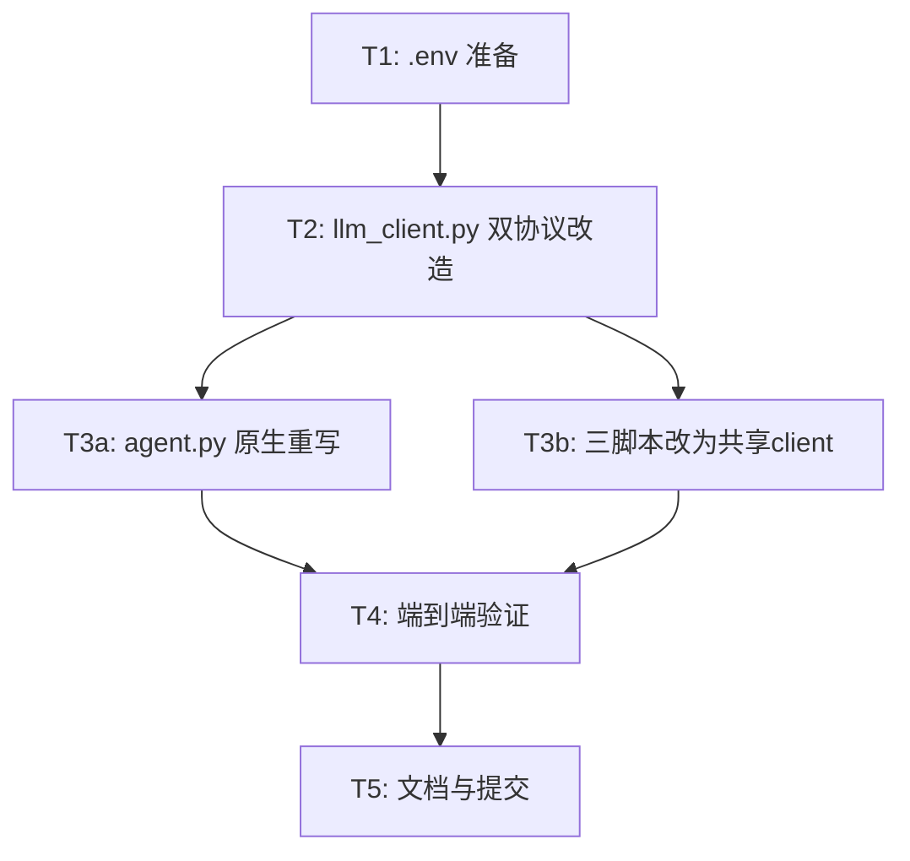

# Plan: 切换至 MiniMax 官方 API（保留 klugai 作为 fallback）

## Objective

将 pixelclaw 项目当前依赖的第三方 relay（minnimax.chat，转发到 MiniMax-M3）替换为 **MiniMax 官方 API**（中国大陆版），同时保留现有 klugai relay（Anthropic 协议，claude-haiku-4-5-20251001）作为故障转移（fallback），确保服务在 MiniMax 官方 API 不可用时仍可正常工作。

## Scope

### In-Scope
- `.env`：新增 MiniMax 官方 API 凭证，移除已废弃的 minnimax relay 备用变量
- `api/services/llm_client.py`：`make_client()` / `call_with_fallback()` 改造为 MiniMax 官方(OpenAI 兼容协议) primary + klugai(Anthropic 协议) fallback 双协议支持
- `api/services/agent.py`：`PixelClawAgent._loop()` 原生重写为 OpenAI function-calling 循环，同时保留对 klugai fallback（Anthropic 协议）的完整支持
- `scenarios/boss/scripts/smart_match_greet.py`、`scenarios/liepin/scripts/smart_match_greet.py`、`scenarios/zhilian/scripts/smart_match_greet.py`：移除各自重复的 `_make_client`/`_call_with_fallback`，改为 import 共享的 `llm_client.py`
- `PROJECTWIKI.md` / `CHANGELOG.md` 同步更新（G1 要求）

### Out-of-Scope
- StepFun step1v 视觉模型子系统（`config/api_keys.json`、`config/settings.yaml` 中的 `strategies.step1v`、`strategies/step1v_strategy.py`）—— 完全独立子系统，本次不涉及
- `pixelclaw-pilot` 前端项目 —— 仅使用 `PIXELCLAW_API_KEY` 做前后端鉴权，与本次 LLM 客户端改造无关
- ADB/设备自动化、评分逻辑本身的算法调整 —— 仅涉及 LLM 调用协议层，不改变业务逻辑

## 已确认的架构决策

| 决策点 | 结论 |
|---|---|
| klugai fallback 是否保留 | **保留**，作为 MiniMax 官方 API 故障时的备用链路 |
| agent.py 重写方式 | **直接原生重写**为 OpenAI function-calling 格式，不在 llm_client.py 做"伪装 Anthropic 对象"的适配层 |
| MiniMax base_url | **中国大陆版** `https://api.minimaxi.com/v1` |

## Standards Compliance

### Global Standards
**来源**: `C:\Users\laiyi\.claude\CLAUDE.md`

- **G1 文档一等公民**：本次涉及代码变更（P3），完成后必须同步更新 `PROJECTWIKI.md` 和 `CHANGELOG.md`，提交信息遵循 Conventional Commits 并建立代码↔文档双向关联
- **G5 安全与合规**：新的 MiniMax API Key 只写入 `.env`（已确认 gitignore，未被 git 追踪），绝不写入 plan.md、commit message 或任何日志
- **G7 敏感信息脱敏**：本文档及后续所有对话输出中，MiniMax API Key 使用占位符 `<MINIMAX_API_KEY>`，不展示明文
- **G9 测试覆盖率**：本次改造涉及协议层核心逻辑，建议为 `llm_client.py` 和 `agent.py` 新增/修改逻辑补充单测，目标覆盖率参考项目标准（85%/最低70%）
- **G12 任务开始时创建 Issue**：本次改动跨 4+ 文件、涉及核心 LLM 调用协议，属于实质性代码改动，将在 P3 阶段创建 GitHub Issue

### 本次不涉及知识库结构性重建，仅做增量更新（G2 既有项目策略）。

## Milestones

1. [ ] **M1 - 环境变量准备**：`.env` 新增 MiniMax 官方 API 凭证，移除废弃变量
2. [ ] **M2 - 共享客户端层改造**：`llm_client.py` 支持双协议（MiniMax OpenAI 格式 primary + klugai Anthropic 格式 fallback）
3. [ ] **M3 - Agent 原生重写**：`agent.py` 的 tool_use 循环改为原生 OpenAI function-calling，同时兼容 klugai fallback 响应格式
4. [ ] **M4 - 脚本层去重**：三个 `smart_match_greet.py` 统一改为 import 共享 `llm_client.py`
5. [ ] **M5 - 端到端验证**：MiniMax 主路径 + klugai fallback 路径均验证通过
6. [ ] **M6 - 文档与提交**：更新 `PROJECTWIKI.md`/`CHANGELOG.md`，创建 GitHub Issue，原子提交

## Task Breakdown

### Phase T1: 环境变量准备（对应 M1）
**目标**：为 MiniMax 官方 API 准备凭证，不破坏现有 klugai 配置

- [x] **T1.1**：备份当前 `.env` 为 `.env.bak`（本地保留，不进 git）— 完成
- [x] **T1.2**：`.env` 新增 `MINIMAX_API_KEY` / `MINIMAX_BASE_URL=https://api.minimaxi.com/v1` — 完成（key 仅写入 `.env`，未出现在任何文档）
- [x] **T1.3**：删除已废弃的 `ANTHROPIC_BACKUP_API_KEY` / `ANTHROPIC_BACKUP_BASE_URL` — 完成
- [x] **T1.4**：保留 `ANTHROPIC_API_KEY` / `ANTHROPIC_BASE_URL`（klugai）不变 — 完成
- [x] **T1.5**：最小化请求验证 `https://api.minimaxi.com/v1/chat/completions` — 完成
- 依赖：无
- 验收标准：新 key 请求成功返回 200 + 有效 completion ✅

**T1 执行结论（含新发现，直接影响 T2 设计）**：
- MiniMax 官方 API（`https://api.minimaxi.com/v1`，model `MiniMax-M3`）文本与 tool calling 均验证通过；`finish_reason == "tool_calls"`，`tool_calls[i]` 提供 `.id` / `.function.name` / `.function.arguments`（JSON 字符串）
- klugai fallback（`claude-haiku-4-5-20251001`）同步验证通过，`stop_reason == "end_turn"`
- **新发现**：`MiniMax-M3` 把推理过程以 `<think>...</think>` **内联在 `content` 字段**中，且**不提供** `reasoning_content` 独立字段。因此 `MiniMaxProvider.parse_response` 必须剥离 `<think>` 块：推理文本单独返回供 `[思考]` 日志广播，剩余正文作为 `content`；回写 messages 历史时不得携带 `<think>` 块
- 项目已安装 `openai` 2.8.1，无需新增依赖

### Phase T2: `llm_client.py` Provider 抽象改造（对应 M2）
**目标**：将"协议差异"封装为统一的 Provider 抽象，`make_client()` 返回硬编码的 provider 列表（不做配置驱动注册表——当前仅 2 个 provider，YAGNI），`call_with_fallback()` 按顺序尝试列表中的 provider

**设计（已与用户确认：Provider 类抽象 + 硬编码 list，不做 config 驱动注册表）**：
```python
class LLMProvider(Protocol):
    name: str
    def build_request(self, messages: list[dict], tools: list[dict]) -> dict: ...
    def call(self, client, request: dict): ...
    def parse_response(self, response) -> dict: ...  # 统一解析为内部消息格式

class MiniMaxProvider:   # OpenAI 兼容协议
    name = "minimax"
    def build_request(self, messages, tools):
        return {"model": "MiniMax-M3", "messages": to_openai_messages(messages),
                "tools": to_openai_tools(tools)}
    def call(self, client, request):
        return client.chat.completions.create(**request)
    def parse_response(self, response) -> dict:
        # 解析 choices[0].message，统一成内部格式
        ...

class KlugaiProvider:    # Anthropic 协议
    name = "klugai"
    def build_request(self, messages, tools):
        return {"model": "claude-haiku-4-5-20251001", "messages": to_anthropic_messages(messages),
                "tools": tools}  # tools 已是 Anthropic input_schema 格式，不变
    def call(self, client, request):
        return client.messages.create(**request)
    def parse_response(self, response) -> dict:
        # 解析 .content 块，统一成内部格式
        ...
```

- [ ] **T2.1**：`make_client()` 改造：返回硬编码 provider 列表 `[(minimax_openai_client, MiniMaxProvider()), (klugai_anthropic_client, KlugaiProvider())]`
  - MiniMax 客户端基于 `openai.OpenAI(api_key=MINIMAX_API_KEY, base_url=MINIMAX_BASE_URL)`（新增 `openai` 包依赖，若项目尚未安装需加入 requirements）
  - klugai 客户端保持 `anthropic.Anthropic(api_key=ANTHROPIC_API_KEY, base_url=ANTHROPIC_BASE_URL)`（不变）
- [ ] **T2.2**：`call_with_fallback()` 改造为按顺序遍历 provider 列表：对每个 `(client, provider)` 调用 `provider.call(client, provider.build_request(messages, tools))`，捕获对应 SDK 的限流/服务端错误类型后重试，全部重试失败后切换到下一个 provider
  - 返回值改为 `(response, provider: LLMProvider)`，上层通过 `provider.parse_response(response)` 解析，不再用字符串/duck-typing 判断协议
- [ ] **T2.3**：迁移三脚本中 klugai 特有的 429 `resetAt` 解析逻辑（`_extract_reset_at`）到 `KlugaiProvider` 内部（或 `llm_client.py` 共享函数供 `KlugaiProvider` 调用），确保不丢失原有限流处理能力
- [ ] **T2.4**：`MiniMaxProvider.build_request` 内部调用的 `to_openai_tools()` 转换函数，将统一的工具元数据转换为 OpenAI `function.parameters` 格式；`KlugaiProvider` 沿用现有 Anthropic `input_schema` 格式；两者从同一份工具元数据 source of truth 生成（见 T3a.1），处理字段命名差异（如 `required` 数组位置），并配单测覆盖
- 依赖：T1（需要新 env 变量已存在）
- 验收标准：单测覆盖 `to_openai_tools` 字段一致性；`call_with_fallback` 在强制 MiniMax 失败时能正确切换到 `KlugaiProvider` 并返回对应 provider 实例
- **明确不做**：不引入 YAML/JSON 配置文件驱动的 provider 注册表、不做动态反射加载——仅用硬编码 Python list，未来如需运维层动态调整再评估

### Phase T3a: `agent.py` 原生重写（对应 M3，可与 T3b 并行）
**目标**：`PixelClawAgent._loop()` 原生支持 OpenAI function-calling，同时能在 fallback 到 klugai 时正确处理 Anthropic 协议响应

**核心设计（Provider 抽象方案，取代原 used_client 字符串分支）**：
- Agent 内部维护**自定义、不绑定任何厂商协议的中间消息格式**：
  ```python
  {"role": "user"|"assistant"|"tool", "content": str,
   "tool_calls": [{"id": str, "name": str, "input": dict}] | None,
   "tool_call_id": str | None}
  ```
- 每轮调用 `llm.call_with_fallback()` 获取 `(response, provider)`，`provider` 是 T2 中定义的 `MiniMaxProvider` / `KlugaiProvider` 实例
- 序列化/解析全部委托给 `provider`：`provider.build_request(messages, tools)` 生成请求体，`provider.parse_response(response)` 解析为统一内部格式后 append
- `agent.py` 完全不判断"是 minimax 还是 klugai"，不做 `hasattr`/duck-typing，协议差异被封装在各 Provider 类内部；未来加第三个 provider 时 `agent.py` 无需任何改动

- [ ] **T3a.1**：定义单一 source of truth 的工具元数据（name/description/parameters），供 `MiniMaxProvider.build_request`（转 OpenAI function-calling 格式）与 `KlugaiProvider.build_request`（转 Anthropic input_schema 格式）共同使用，避免重复维护
- [ ] **T3a.2**：（已移至 T2，随 `MiniMaxProvider` 实现）
- [ ] **T3a.3**：（已移至 T2，随 `KlugaiProvider` 实现，基于现有逻辑重构）
- [ ] **T3a.4**：重写 `_loop()`：每轮调用 `llm.call_with_fallback()` 获取 `(response, provider)`，调用 `provider.parse_response(response)` 得到统一格式后 append 到内部 messages；其余循环控制逻辑（`MAX_STEPS`、`_execute_tool` 调用、broadcast 日志）保持不变
- [ ] **T3a.5**：`_execute_tool()` 与各工具实现函数（`_exec_check_boss_stats` 等）不需改动，因为它们只处理 dict 输入，与协议无关
- 依赖：T2（依赖 `call_with_fallback` 返回 `(response, provider)` 及两个 Provider 类已实现）
- 验收标准：
  - 集成测试 1：mock MiniMax 返回 tool_calls，验证 agent 正确解析并执行工具，走完一轮 end_turn
  - 集成测试 2：强制 primary 失败（如临时改错 MINIMAX_API_KEY），验证自动 fallback 到 klugai，且能完整走完一轮 tool_use 流程

### Phase T3b: 三脚本统一改为共享 client（对应 M4，可与 T3a 并行）
**目标**：消除 `smart_match_greet.py`（boss/liepin/zhilian）中重复的 `_make_client`/`_call_with_fallback` 定义

- [ ] **T3b.1**：`scenarios/boss/scripts/smart_match_greet.py`：删除自定义 `_make_client()`（第334-361行）、`_extract_reset_at()`（364-376行，已迁移至 llm_client.py）、`_call_with_fallback()`（379-422行），改为 `from api.services import llm_client as llm`，调用处改为 `llm.make_client()` / `llm.call_with_fallback()`
- [ ] **T3b.2**：`extract_resume_summary()`、`score_job()` 调整为使用新的 `call_with_fallback` 返回签名 `(response, used_client)`，响应解析按 `used_client` 分支处理（MiniMax 走 `response.choices[0].message.content`，klugai 走 `response.content[0].text`）
- [ ] **T3b.3**：对 `scenarios/liepin/scripts/smart_match_greet.py` 和 `scenarios/zhilian/scripts/smart_match_greet.py` 执行相同改造（结构近似，逐一确认字段差异后统一）
- 依赖：T2
- 验收标准：三个脚本各跑一次 `extract_resume_summary`/`score_job`，确认 MiniMax 官方 API 调用成功返回内容且格式解析正确

### Phase T4: 端到端验证（对应 M5）
- [ ] **T4.1**：正常路径：触发一次 `run_smart_greet`，确认 agent.py 通过 MiniMax 官方 API 完成完整 tool_use 循环
- [ ] **T4.2**：Fallback 路径：临时使 MiniMax key 失效，重跑同一流程，确认自动切换到 klugai 且流程不中断
- [ ] **T4.3**：三脚本单独验证（T3b.3 已包含，此处做汇总确认）
- [ ] **T4.4**：确认无残留明文 API Key 写入任何非 `.env` 文件（grep 检查 `sk-cp-` 前缀）
- 依赖：T3a、T3b

### Phase T5: 文档与提交（对应 M6）
- [ ] **T5.1**：更新 `PROJECTWIKI.md`：架构设计章节说明新的双协议 fallback 机制；如有 ADR 目录，新增一条 ADR 说明"从第三方 relay 切换到 MiniMax 官方 API"的决策背景与取舍
- [ ] **T5.2**：更新 `CHANGELOG.md`：在 `[Unreleased]` 下的 `Changed` 分区记录本次变更
- [ ] **T5.3**：创建 GitHub Issue（G12，本次改动跨 4+ 文件且涉及核心调用协议，满足创建条件），后续 commit 关联 `refs #N` / `closes #N`
- [ ] **T5.4**：原子提交：代码变更 + 文档变更一次提交，遵循 Conventional Commits

## Dependencies



## Risk Management

| 风险 | 影响 | 概率 | 缓解措施 |
|------|------|------|----------|
| agent.py 双格式分支逻辑复杂度高，可能引入 tool_use 解析 bug | 高 | 中 | 先写 MiniMax 路径、klugai fallback 路径两组集成测试，再改主逻辑 |
| MiniMax tool_calls 的 parameters schema 与 Anthropic input_schema 字段结构存在差异 | 中 | 中 | 编写 `_tool_schema_to_openai()` 专用转换函数并单测覆盖字段一致性 |
| 三脚本迁移 429 `resetAt` 解析逻辑时可能遗漏 klugai 特有字段 | 中 | 低 | 迁移时逐行对比原实现，确保行为等价 |
| 中国大陆版 base_url 此前未独立验证可用性 | 低 | 低 | T1.5 执行阶段第一步先做最小化请求验证，再改动业务代码 |
| MiniMax 官方 API 联调周期超预期，影响服务可用性 | 中 | 低 | 回滚方案：`.env` 中 MiniMax 变量置空时，`make_client` 直接跳过 primary、只用 klugai，保证服务不中断 |

## Resource Requirements
- **工具/依赖**：可能需新增 `openai` Python 包（若项目当前未安装），用于调用 MiniMax 官方 OpenAI 兼容接口
- **凭证**：MiniMax 官方 API Key（用户已提供，执行时写入 `.env`，不进入任何文档/提交历史）

## Acceptance Criteria
- [ ] `.env` 更新完成，无明文 key 泄露到 git 或文档
- [ ] `llm_client.py` 支持 MiniMax(primary) + klugai(fallback) 双协议调用，返回 `used_client` 标记
- [ ] `agent.py` 原生支持 OpenAI function-calling，且 fallback 到 klugai 时行为正确（集成测试通过）
- [ ] 三个 `smart_match_greet.py` 统一使用共享 `llm_client.py`，无重复客户端定义
- [ ] 端到端测试：MiniMax 主路径成功 + 强制 fallback 路径成功
- [ ] `PROJECTWIKI.md` / `CHANGELOG.md` 同步更新，GitHub Issue 已创建并在 commit 中关联

##回滚方案
- pixelclaw 目录本身是独立 git 仓库（已确认，当前 `main` 分支与 `origin/main` 有分叉但工作区状态正常），可通过 `git diff` / `git checkout -- <file>` 逐文件回退
- `.env` 改动前已备份为 `.env.bak`（本地文件，不进 git，执行前手动创建）
- 若 MiniMax 官方 API 长期不可用，可通过清空 `.env` 中 `MINIMAX_API_KEY` 使系统自动降级为纯 klugai 模式，不影响服务可用性

## Review History
- Planner (gemini-3-pro-preview via zen-mcp)：完成 3 步规划（任务分解 → 双格式 fallback 设计 → 验收标准与回滚方案），未发现需要额外澄清的问题

## Revision Log
- 2026-09-25：初始计划创建
